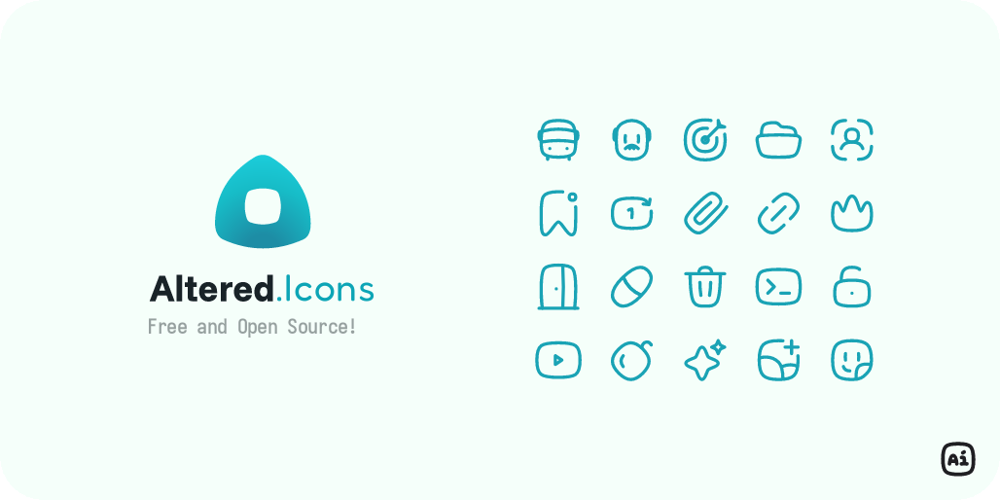

	

# Altered Icons (AI): A collection of modern and purposeful icons

  

**Altered Icons** is a collection of icons in SVG raw format. Created for use in design, web, or app projects. You have the option to choose between two icon types that best suit your needs, chubby or flatter.

> + 🎯 Simple and stylish icons.
> + 🚀 Inspired by the present, created for the future.

+ <a href="https://github.com/dot-alter/Altered-Icons/releases" target="_blank">📦 Download SVG files from GitHub Release</a>

---

## 👨‍🚀 Start your journey through Altered Icons!

Find out more details about the creation of this new library of icons and obtain some resources.

+ [💭 About →](docs/guide/README.md)
+ [🧭 Project Principles →](docs/guide/principles/01_basics.md)
+ [🎨 Icon Design →](docs/guide/principles/02_design.md)
+ [📐 Metrics & Guidance →](docs/guide/principles/03_metrics.md)
+ [🎁 Contributing →](CONTRIBUTING.md)

---

## 🌐 Why another icon library?

We believe that simplicity does not have to be boring.

Altered Icons was created on the belief that functional design can also be expressive, innovative, and enjoyable.

That is why we decided to begin this project with a clear personality and philosophy 🥊. And of course, offer a creative, free, and open-source alternative.

We're inspired by initiatives like *Lucide Icons* and *Streamline Icons Flex*, but **AI** (Altered Icons) has its own distinct aesthetic. **Our goal is not to replace, but rather to provide an alternative**.

---

## 🎁 Contribute
This project is open to suggestions, feedback, and contributions. You have the option to do any of these or search for more information in the Discord community.

+ [How to contribute →](CONTRIBUTING.md)
+ [Join the Discord community as a pioneer (visit)](https://discord.gg/RHBKyNywMv)

---

## 🧪 Changelog History

Please see the [full changelog →](CHANGELOG.md) for all new features, improvements, and version changes.

---

## 🛂 License (ISC)

Any project may use Altered Icons without restriction. [License here →](LICENSE.md).
