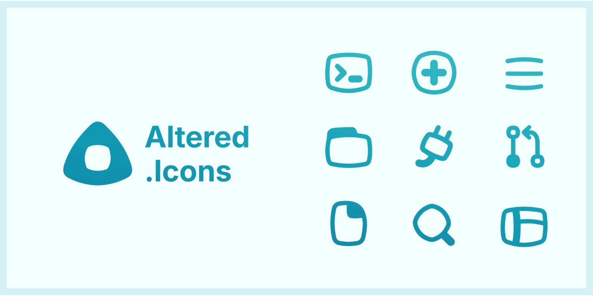

	

# Altered Icons (AI): A collection of modern and purposeful icons

  

**Altered Icons** is an icon collection designed for the future of digital design. Icons that are visually simple, accessible, and distinctive are intended to improve modern interfaces and make interactive experiences more humanlike.

> + 🎯 Simple, usable, and stylish icons.
> + 🚀 Inspired by the present, created for the future.

+ <a href="https://github.com/dot-alter/Altered-Icons-Pack/releases" target="_blank">📦 Download from GitHub Release</a>

---

## 👨‍🚀 Start your journey through Altered Icons!
Available for:

+ [🇬🇧 English (UE) (99%) →](./docs/en/README.md)
+ [🇪🇸 Español (98%) →](./docs/es/README.md)
+ [🇨🇳 简体中文 (94%) →](./docs/zh-Hans/README.md)
<!-- + [🇧🇷 Português →](./docs/pt-BR/README.md) -->

### 🔗 Quick jump → English (UE)

+ [💭 About →](docs/en/README.md)
+ [🧭 Project Principles →](./docs/en/01_principles.md)
+ [🎨 Icon Design →](./docs/en/02_design.md)
+ [📐 Metrics & Guidance →](./docs/en/03_metrics.md)
+ [🎁 Contributing →](./docs/en/CONTRIBUTING.md)

---

## 🌐 Why another icon library?

We believe that simplicity does not have to be boring.

Altered Icons was created on the belief that functional design can also be expressive, innovative, and enjoyable.

That is why we decided to begin this project with a clear personality 🥊. It is more than just another icon collection; it is a proposal with a distinct visual identity and philosophy.

We're inspired by initiatives like *Lucide Icons* and systems like *Material Design*, but Altered Icons has its own distinct aesthetic. **Our goal is not to replace, but rather to provide an alternative**.

---

## 🧪 Changelog History

Please see the [full changelog →](CHANGELOG.md) for all new features, improvements, and version changes.

---

## 🛂 License (ISC)

Any project may use Altered Icons without restriction. [License here →](LICENSE.md).
