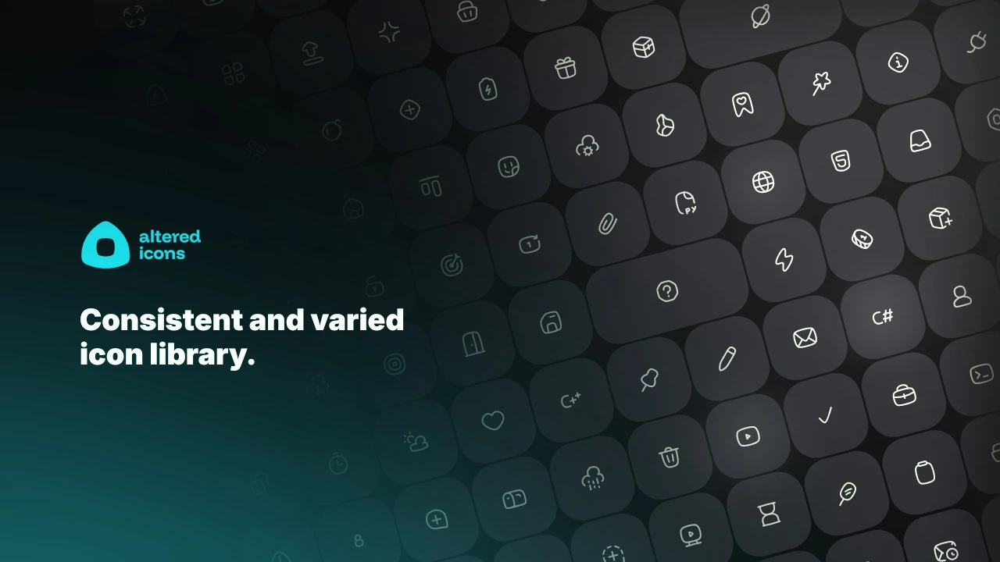

	

# Altered Icons (AI): A collection of modern and purposeful icons
   

A collection of raw SVG icons designed to provide every creator with a wider range of styles. Find the icons you need, whether you're a designer or not.

### Sets:

<table>
	<thead> 
		<th>Style</th>
		<th>Variants</th>
		<th>Catalog</th>
		<th>State</th>
	</thead>
	<tbody> 
		<tr> 
			<td>Chubby</td>
			<td><code>line</code></td>
			<td><a href="https://github.com/dot-alter/Altered-Icons/blob/master/docs%2Fcatalog%2Fchubby%2Fchubby-line.md">chubby-line</a></td>
			<td>✅</td>
		</tr>
		<tr> 
			<td>Flatter</td>
			<td><code>line</code></td>
			<td><a href="https://github.com/dot-alter/Altered-Icons/blob/master/docs%2Fcatalog%2Fflatter%2Fflatter-line.md">flatter-line</a></td>
			<td>✅</td>
		</tr>
	</tbody>
	<tfoot> 
		<td colspan="999"><a href="https://github.com/dot-alter/Altered-Icons/releases" target="_blank">📦 Download SVG files from GitHub Release</a></td>
	</tfoot>
</table>

> + **✅ → Active**: Open to PRs and ideas.
> + **⏸️ → Paused**: No active review.
> + **🆕 → Planned**: Discuss on Discord.
> + **🔒 → Locked**: No changes planned.
> <!-- + **‼️ → Deprecated**: Do not use; migration advised. -->
> 

---

## 👨‍🚀 Start your journey through Altered Icons!

Discover more information and resources regarding this library's design, principles and creation process.

+ [📖 Guide →](docs/guide/README.md)
+ [ℹ️ Brand Icons →](BRAND_ICONS.md)
+ [🎁 Contributing →](CONTRIBUTING.md)
+ [🗺️ Roadmap →](ROADMAP.md)
+ <a href="https://discord.gg/RHBKyNywMv" target="_blank">💜 Discord (visit)</a>

---

## 🧪 Changelog History

For all new features, improvements, and version changes, see the [full changelog →](CHANGELOG.md)

---

## 🛂 License (ISC)

Any project may use Altered Icons without restriction. [License here →](LICENSE.md).

If you require any additional information or have questions, please contact us directly at <a mailto="the.dot.alter@gmail.com" target="_blank">the.dot.alter@gmail.com</a>.
