# Diseño de los iconos
Lectura de 5 minutos

 Conoce cómo están estructurados los iconos de Altered Icons, desde el layout base hasta sus proporciones, cuadrícula y morfología visual.

**En esta sección**
+ [Layout ↴](#-layout)
+ [Grid ↴](#-grid)
+ [Geometría y morfología ↴](#-geometría-y-morfología)

## 🔧 Layout
La construcción de la familia de iconos se basa en prácticas estándar del diseño, utilizando un **layout geométrico** que define las proporciones y estilo de cada ícono. Este layout se adapta según el tipo de forma (cuadrada, alta, ancha o circular), manteniéndose dentro de una cuadrícula común.

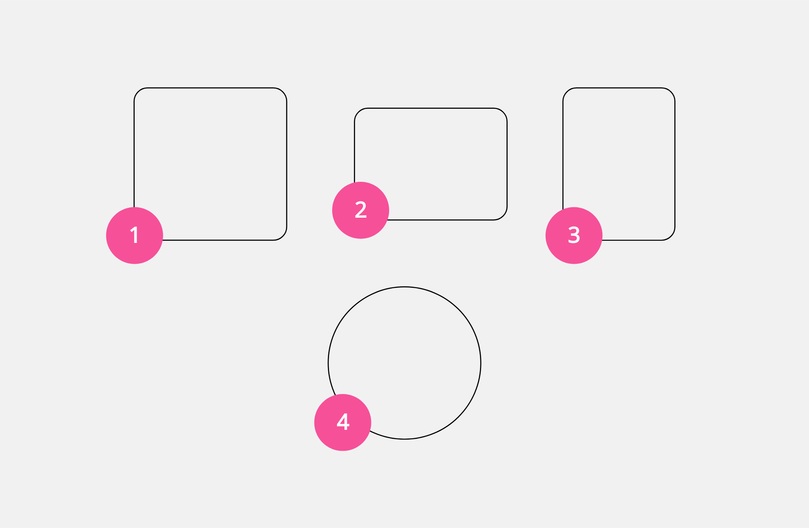

---
## 📈 Grid
La cuadrícula está construida a partir de una caja de `24×24dp`, incluyendo un padding de `2dp` que delimita el contenido para evitar desbordamientos. Esto nos deja con un **área segura** de `20dp` en donde se posicionarán nuestras formas principales.

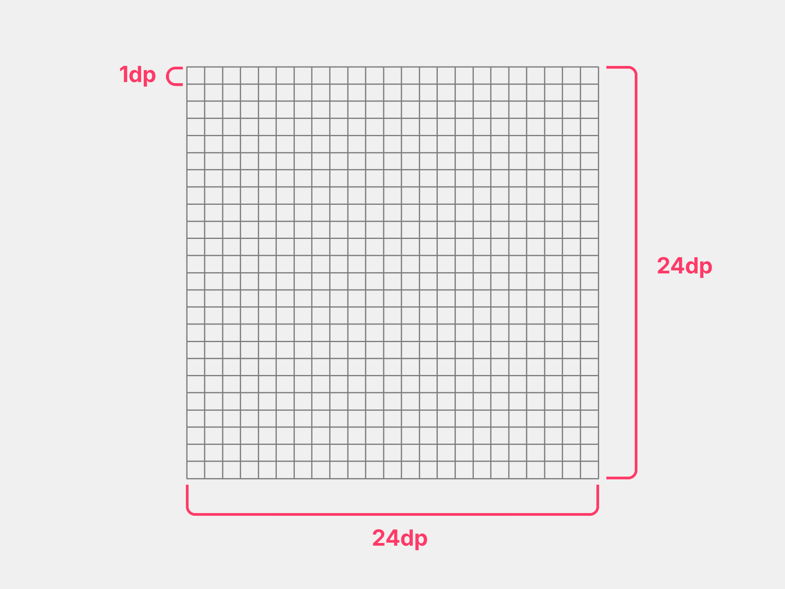
Contenedor base.
24×24px es el tamaño estándar de los iconos en varios entornos.

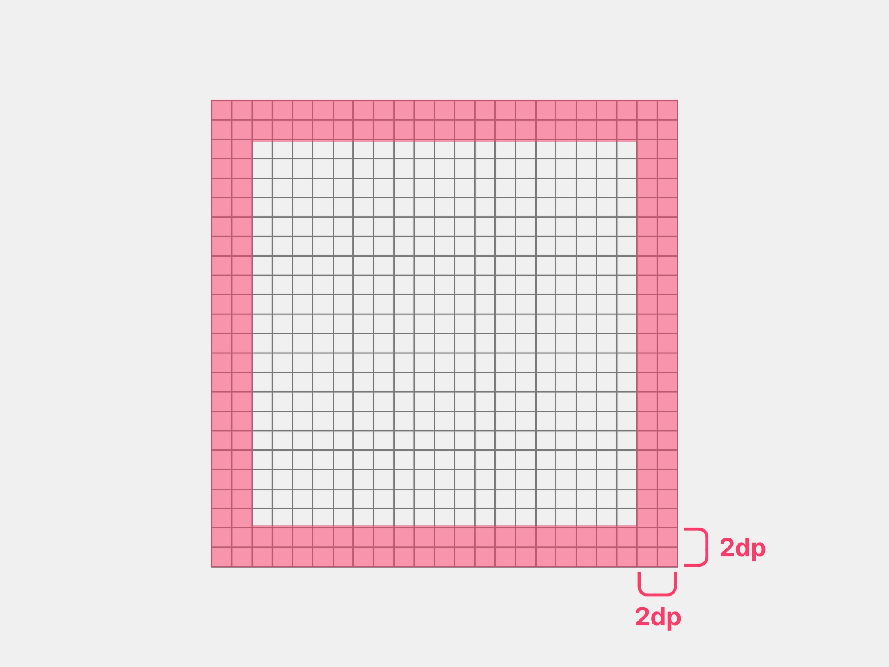
Padding interno de `2dp`.

El padding interno garantiza que los íconos no colisionen visualmente cuando se ubiquen junto a otros elementos en una interfaz. Esto mejora la alineación, el espaciado y la coherencia visual general del sistema de iconos.

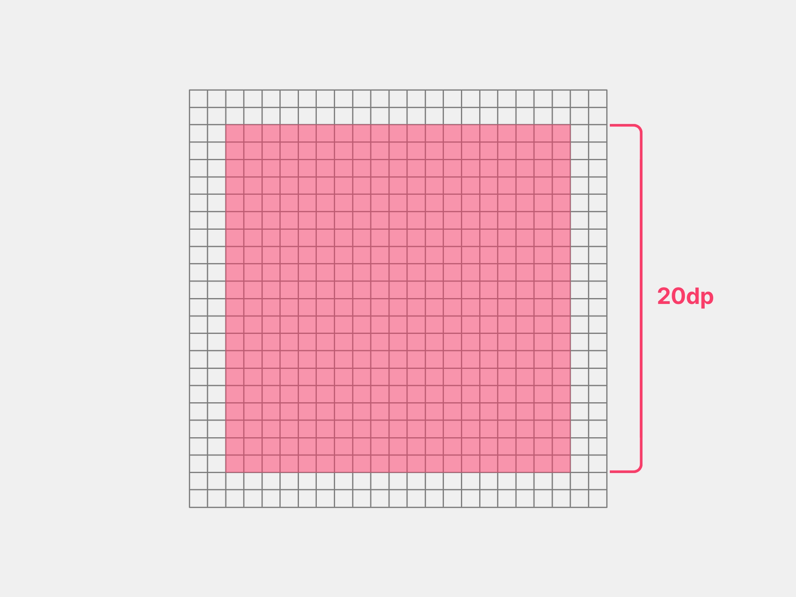
Área segura de `20×20dp`.
Las formas geométricas que definen a los iconos están construidas dentro de la zona segura.

A partir de la grid, construimos el layout específico de Altered-Icons. Sin embargo, partimos primeramente de las formas clave.

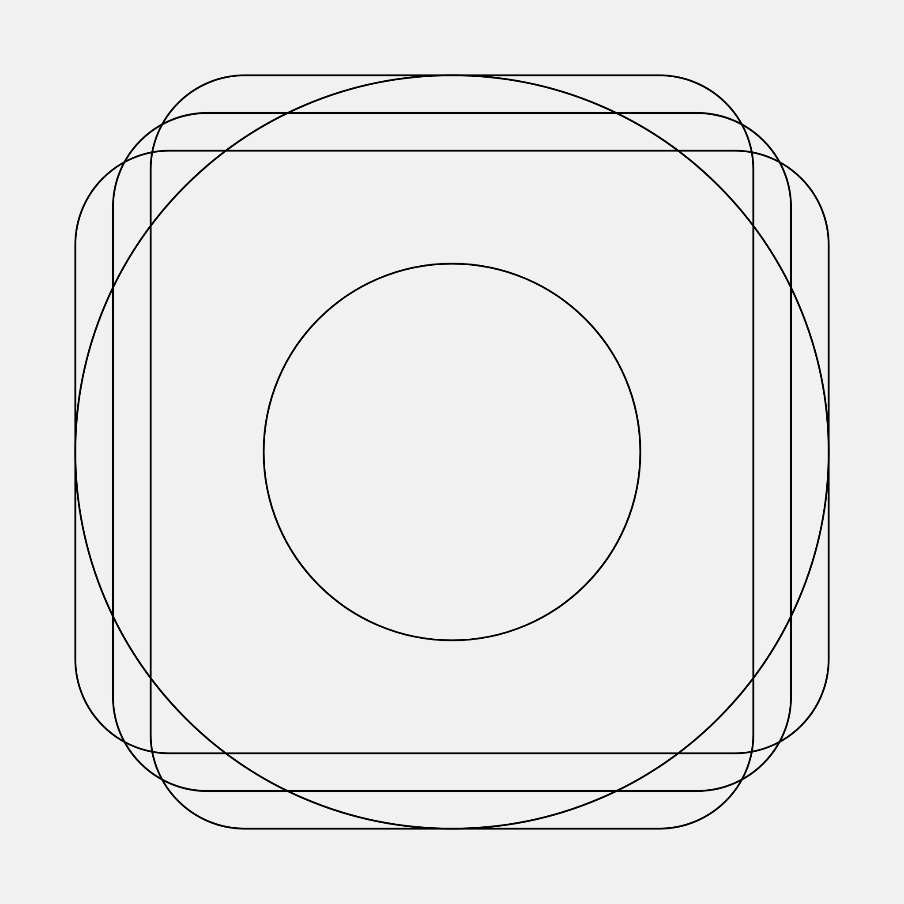
<small>Formas clave básicas.</small>

Estas formas clave se modifican para ajustarse al estilo "alterado" del set, dándoles mayor expresión visual sin romper la coherencia de la cuadrícula.

Formas clave alteradas.

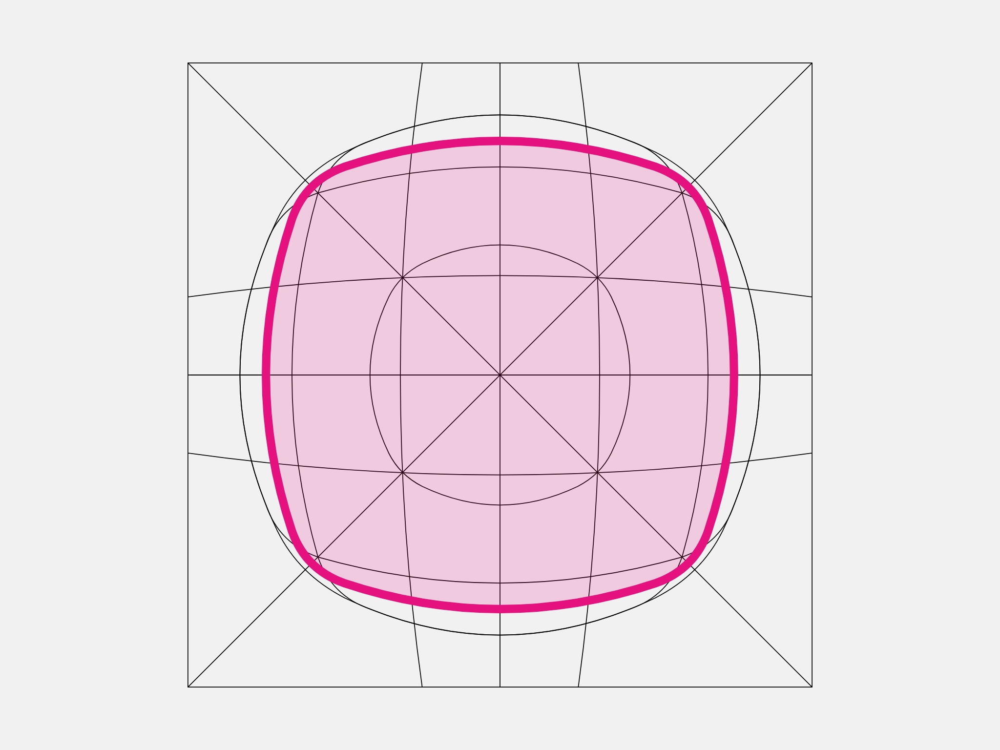
Forma cuadrada de `20×20dp`.
Usar para iconos balanceados geométricamente.

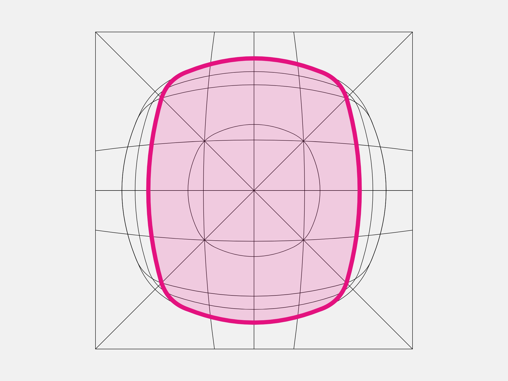
Forma rectangular (vertical).
Usar para iconos con mayor altura.

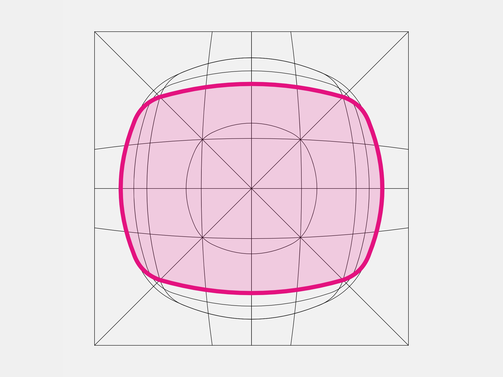
Forma rectangular (horizontal).
Usar para iconos con mayor ancho.

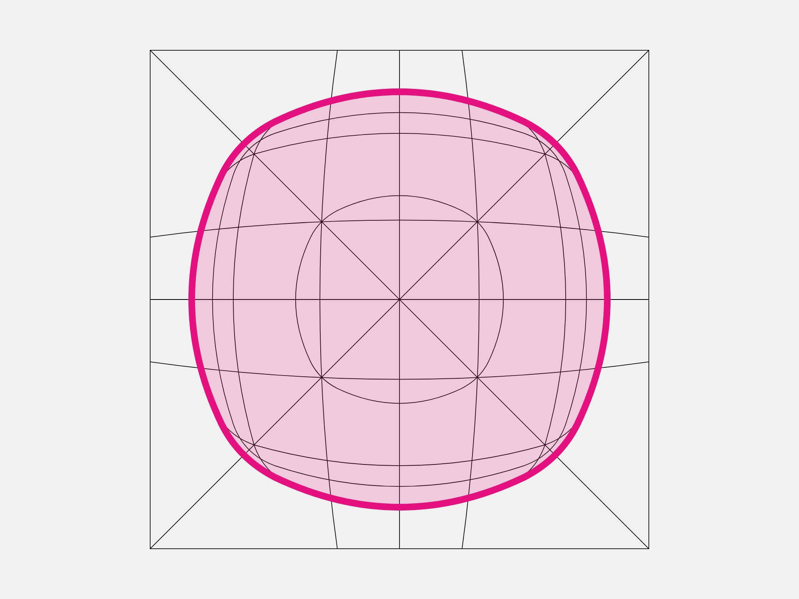
<small>Forma circular base.</small>
Usar para iconos circulares.

### Formas clave adaptadas
También se han separado las **formas clave** para diferentes aplicaciones. Si lo que se busca es construir iconos con una forma específica, lo mejor es usar un layout adaptado, pero sin ser diferente a las formas clave principales de las imágenes anteriores. Por ejemplo:

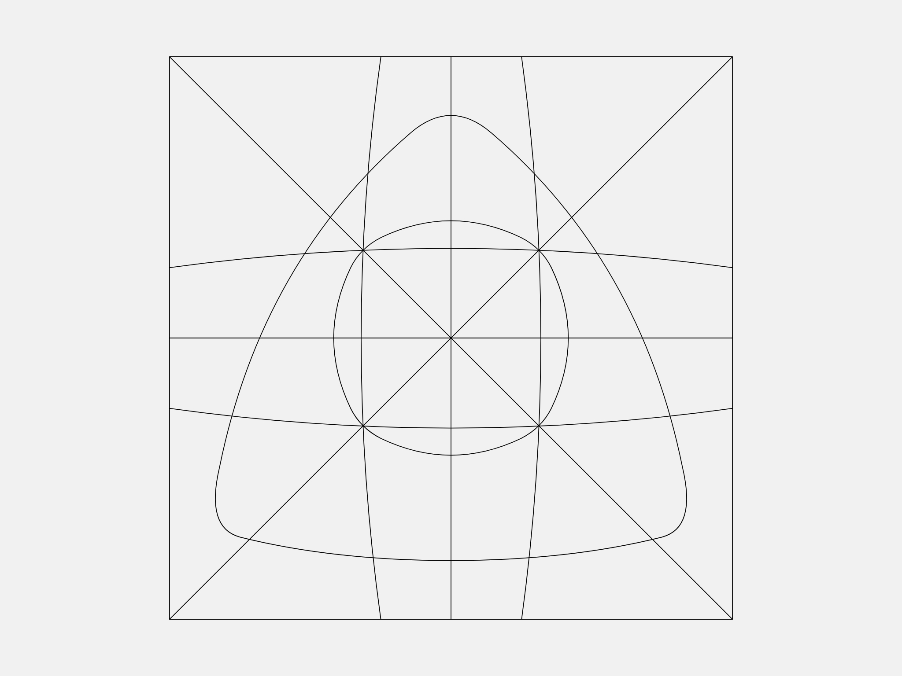
Formas clave triangular.
Para iconos específicamente triangulares.

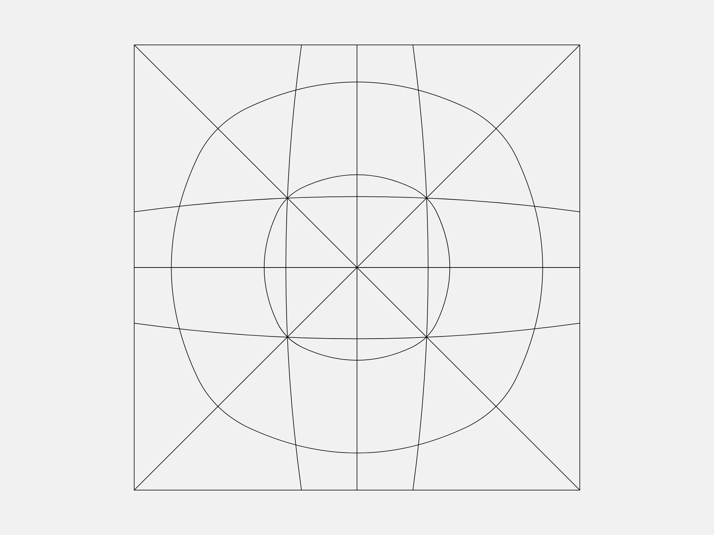
Formas clave para círculos.
Para iconos con tendencia a ser circular.

---
## 🛑 Geometría y morfología 
En general, obtenemos 3 formas básicas: círculo, cuadrado y rectangulo (horizontal/vertical). Cada uno con el estilo correspondiente (líneas ligeramente redondeadas o curvas y no lineas rectas).

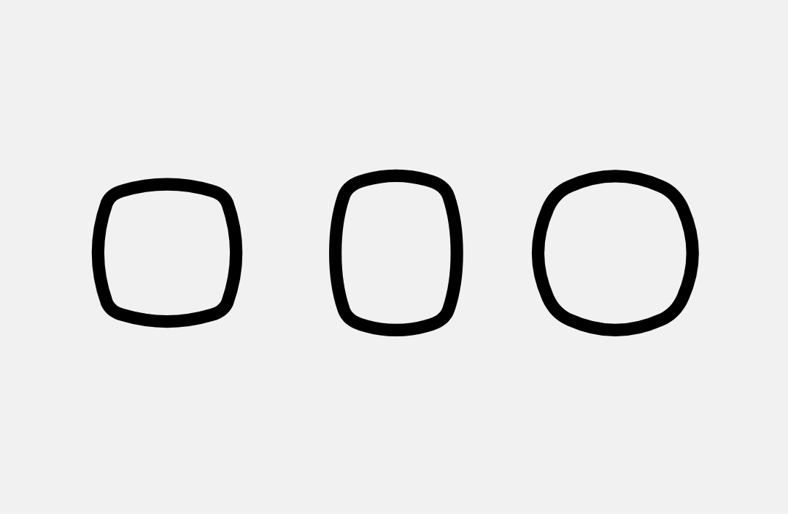
Formas alteradas genéticamente.

Si bien se parte de formas básicas, cada icono puede tomar ciertas libertades en su ajuste según su la necesidad del estilo. Esta flexibilidad no sacrifica la coherencia, ya que todo icono debe respetar y apegarse, en cierta medida, a las **formas base** o **formas clave**.

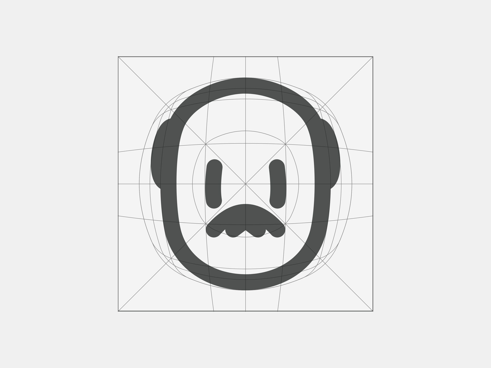
(bald man icon)

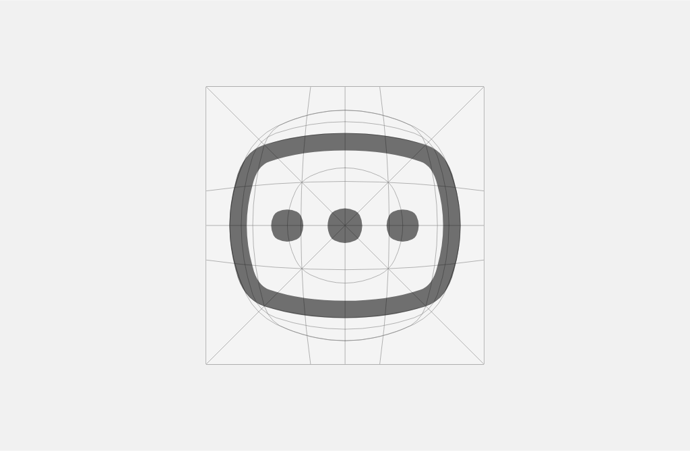
(message box icon)

Sin embargo, no podemos confundir este principio; libertad en la forma de los trazos no significa menos consistencia. Y la consistencia parte de una serie de métricas creadas específicamente para esto.

Esto significa que cada ícono toma en propiedad un parámetro al cual encaminarse. Por ejemplo, si un ícono está diseñado con mayor altura que anchura, ya existe un parámetro que define ésta característica (formas clave o formas base).

---

## 📍 Enlaces relacionados

**Anterior**
+ [Principios del material →](./01_principios.md)

**Siguiente**
+ **[Métricas →](./03_metricas.md)**