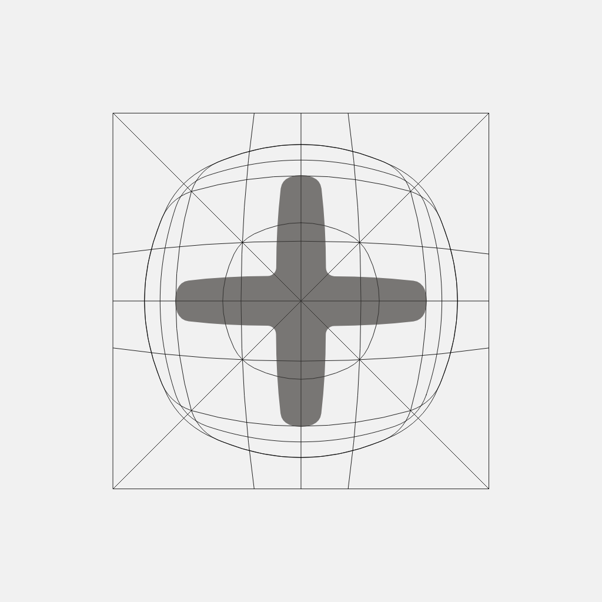
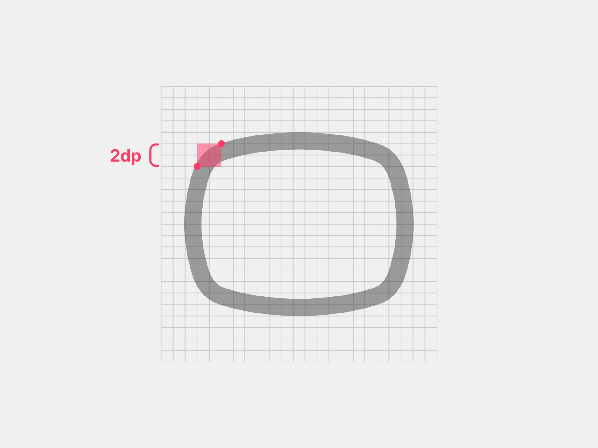
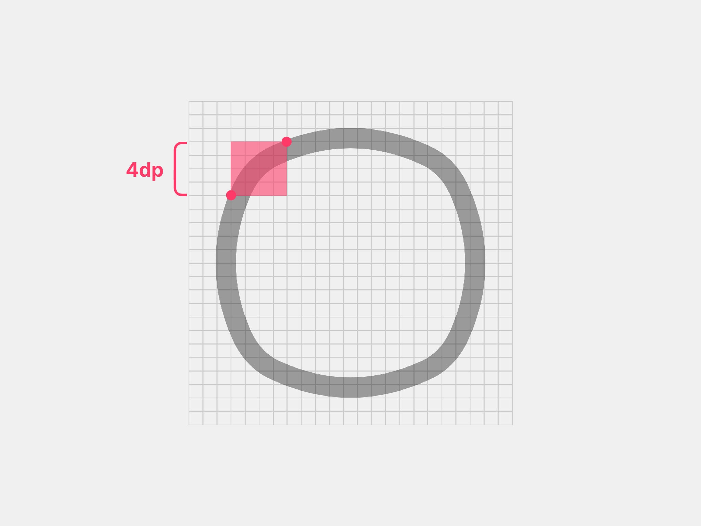
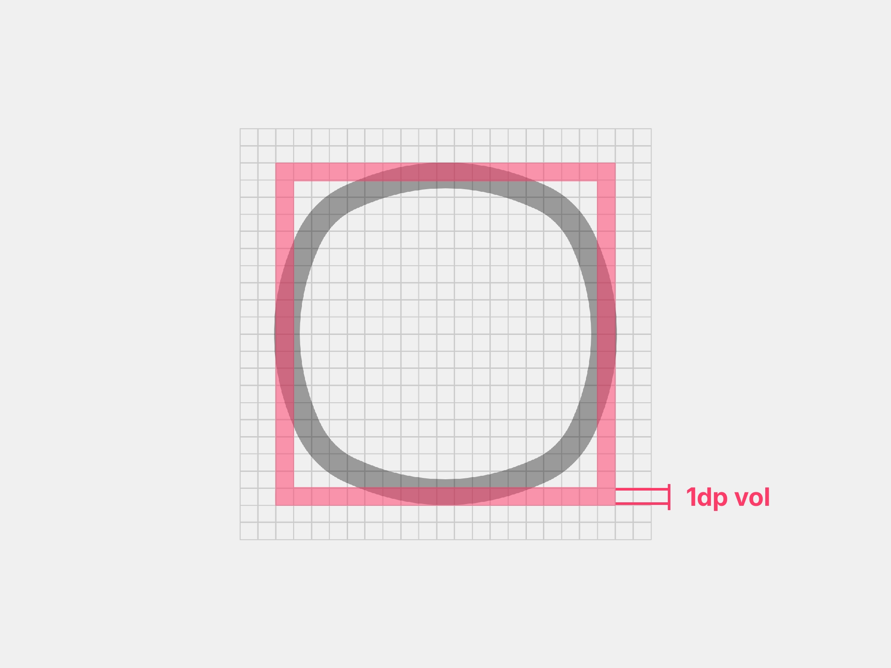

# Métricas de construcción 
Lectura de 3 minutos

**En esta sección**
+ [Stroke ↴](#-stroke)
+ [Bordes ↴](#-bordes)
+ [Size ↴](#-relleno)

---

## 〰️ Stroke

El trazo es esencial para mantener la legibilidad y coherencia visual en distintos tamaños. Se utiliza un grosor de línea de `1.5dp`, aplicado tanto a curvas como a extremos, siempre con alineación al **interior** de la figura.

Una de las características únicas de Altered Icons es la **simulación de trazo independiente**. En lugar de una simple línea de `1.5dp`, se construye una forma completa que replica visualmente ese trazo, pero con volumen propio.

Ai-plus-add

Este método se emplea solo cuando el trazo tradicional no logra integrarse con el estilo visual del icono o rompe la armonía general del diseño.

---

## ↪️ Bordes

Para definir los bordes, se toma como base la cuadrícula de `24×24dp`. En formas cuadradas, rectangulares y triangulares, se aplica un radio de borde de `2dp` en las esquinas.

En el caso de las formas circulares (que no siempre son esferas perfectas), se usa un radio de `4dp` en las esquinas y se ajustan los nodos hasta formar el contorno circular deseado, siguiendo la guía de la forma base circular en la cuadrícula.

Por su parte, el volumen en los bordes se extiende hasta `1dp` de grosor en la línea.

---

## 📍 Enlaces relacionados 

**Anteriores**
+ [Diseño de los iconos →](./02_diseño.md)
+ [Principios de la colección →](./01_principios.md)

**Otros**
+ [Cómo contribuir →](./CONTRIBUIR.md)