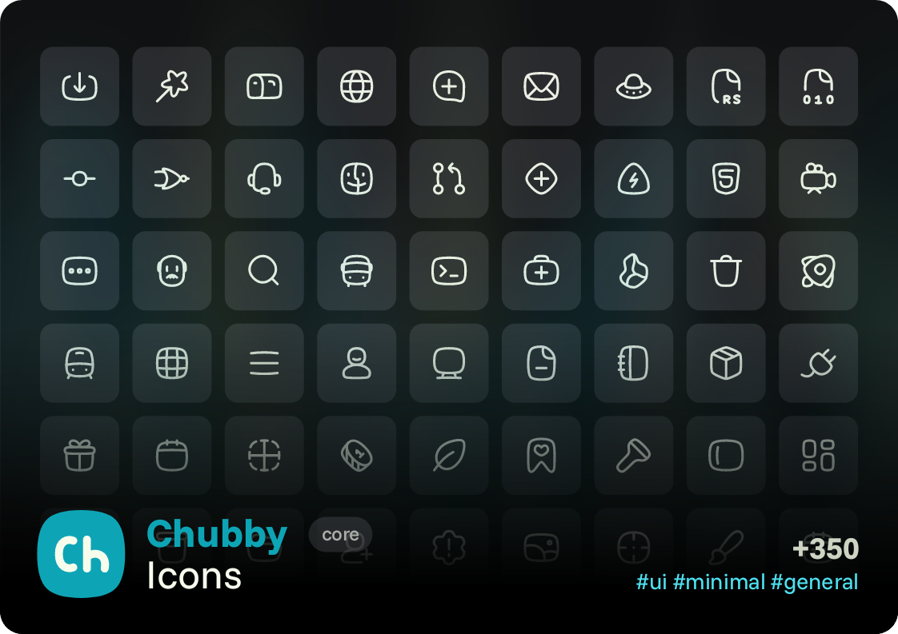

# Chubby Icons: Soft, plumped lines that smooth out any interface
4 min read

<table> 
	<thead> 
		<th>Variants</th>
		<th>Categories</th>
		<th>Formats</th>
		<th>Usecase</th>
	</thead>
	<tbody> 
		<tr> 
			<td><code>line</code></td>
			<td rowspan="999">UI</td>
			<td><code>svg</code></td>
			<td rowspan="999">Websites, applications, logos, motion graphics</td>
		</tr>
	</tbody>
</table>

The Chubby style is a unique alternative, with a flexible design that makes it stand out for its curved shapes and minimalist appearance.

### In this file
+ [Key Shapes](#key-shapes)
	+ [Circular Shape](#circular-shape)
	+ [Square Shape](#square-shape)
	+ [Vertical Rectangle](#vertical-rectangle)
	+ [Horizontal Rectangle](#horizontal-rectangle)
+ [Grid](#grid)
+ [Geometry](#geometry)
	+ [Shapes](#shapes)
	+ [Smoothness](#smoothness)
		+ [Scaling](#scaling)
+ [Synthesis](#synthesis)
+ [Variants](#variants)

---

## Key Shapes

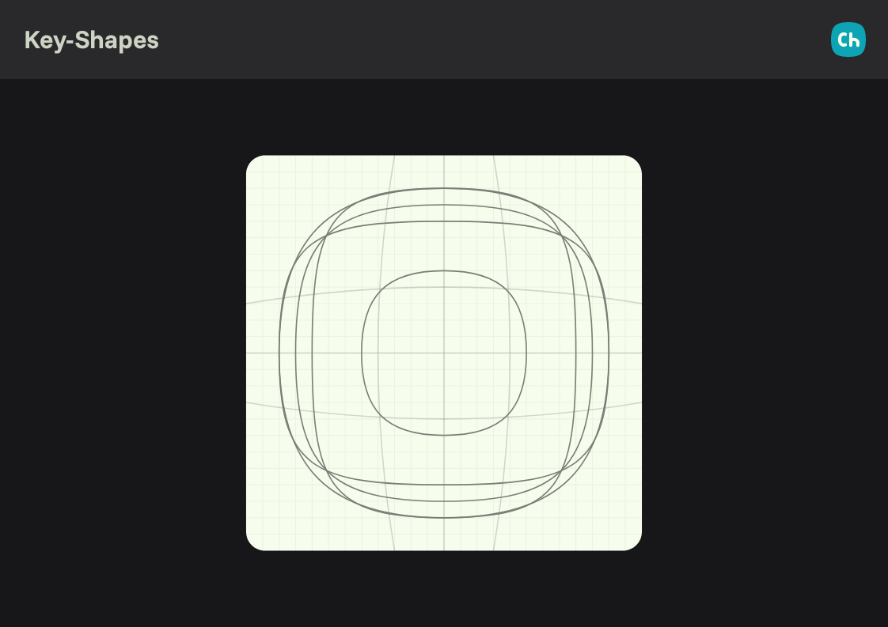

Chubby Icons are built on a set of four foundational key-shapes that define the spatial logic, proportions, and volumetric behavior of the entire style.

Each key-shape corresponds to a specific use-case and aspect ratio, allowing icons to maintain their characteristic softness while adapting to different silhouettes.

### Circular Shape

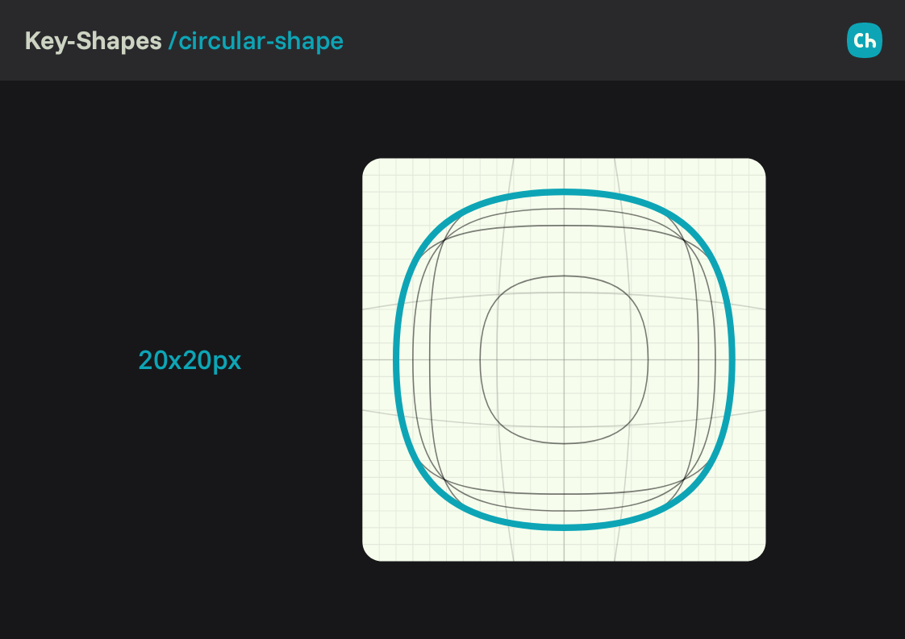

Used for icons whose visual narrative is inherently round or radial.

- Ideal for `circle-*`, `loaders` or circular icons. Example: [`globe.svg`](../../../icons/chubby/line/globe.svg)
- Occupies a `20×20` area inside the `24×24` grid.

### Square Shape

The default and most flexible base shape.

- Used for icons that align well to symmetric or neutral silhouettes.  
- Fits into an `18×18` safe area to maintain visual breathing room.  
- Works particularly well for *UI primitives, common controls, and base objects*.  

### Vertical Rectangle

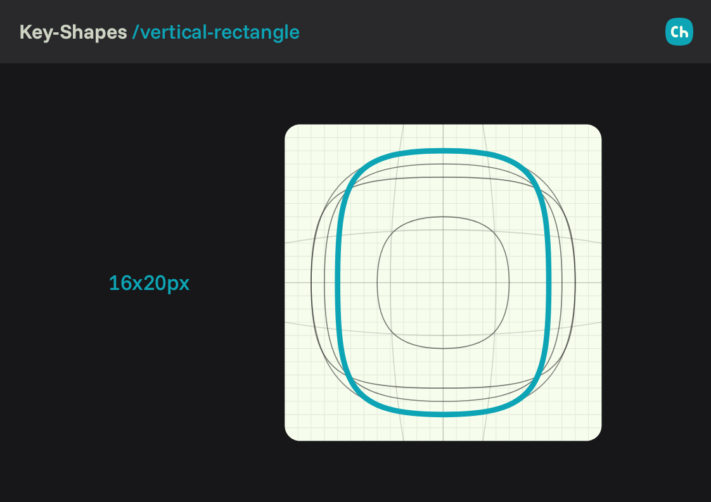

Designed for icons with a taller vertical ratio.

- Best for objects where the height dominates the form (e.g., *clipboard, bookmark, door*).  
- Occupies a `20×16` container, preserving vertical proportions without visual distortion.  

### Horizontal Rectangle

Optimized for icons with wider horizontal proportions.

- Used for symbols like *cards, screens, folders, tabs, mail*.  
- Fits into a `16×20` area, providing horizontal presence without overwhelming the stroke flow.  

---

## Grid

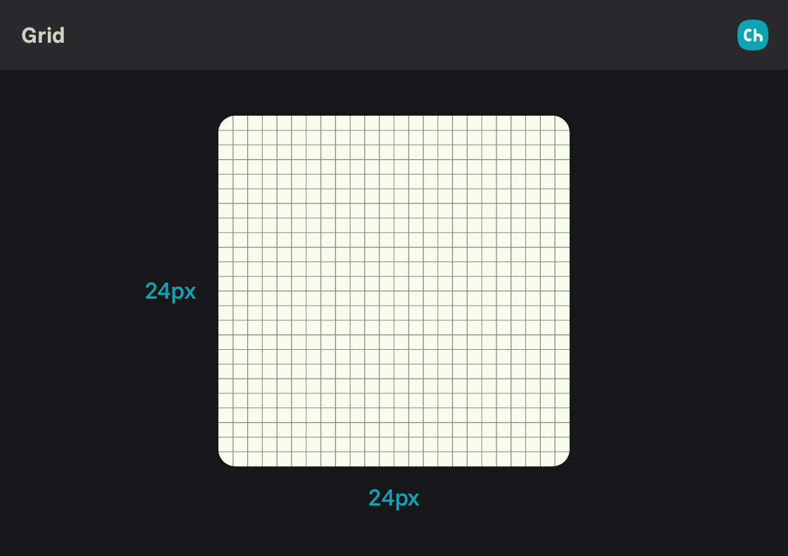

The grid is based on a `24×24px` container, including an internal `1px` padding that defines the boundaries and prevents visual overflow. This results in a safe area of `22px` where key shapes are placed.

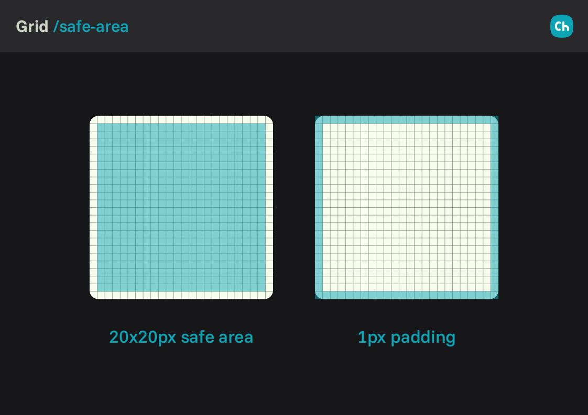

---

## Geometry

### Shapes
The morphology of the iconographic family is built from four basic shapes: circle, square, rectangle, triangle, hexagon, etc.

- Basic shapes (circle, square, triangle and rectangle) are built from 4 nodes. No more, no less.
- All shapes includes corner smoothing

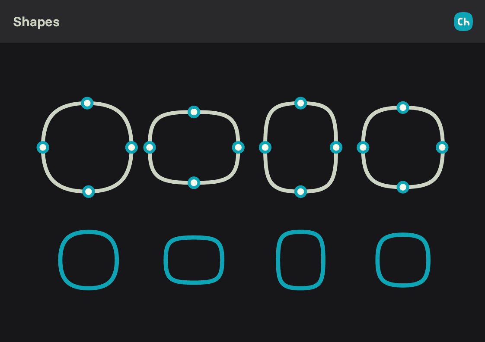

### Smoothness
In the Chubby style, geometric shapes are intentionally constructed with a minimal number of nodes. Unlike flatter styles that rely on additional anchor points to define rounded corners, Chubby shapes use handle manipulation between two nodes to generate smooth, volumetric curves.

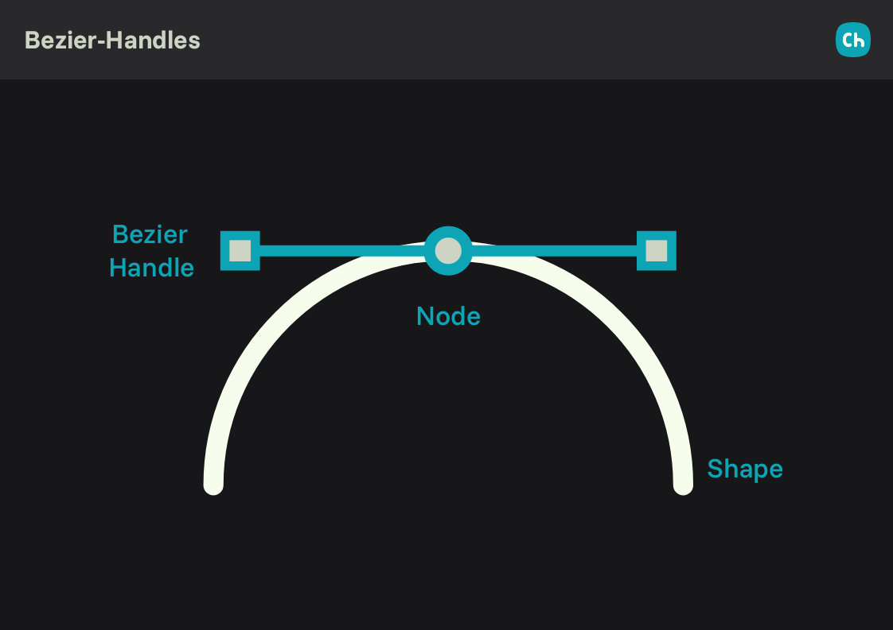

Each node defines two sides of the shape, and the perceived corner smoothness is controlled exclusively through the position and length of the Bezier handles. This approach preserves the characteristic “inflated” appearance of the style while keeping paths simple and editable.

As a result:

- Square shapes achieve their corner softness through handle adjustment, equivalent to a visual smoothness of approximately `2×2px`. 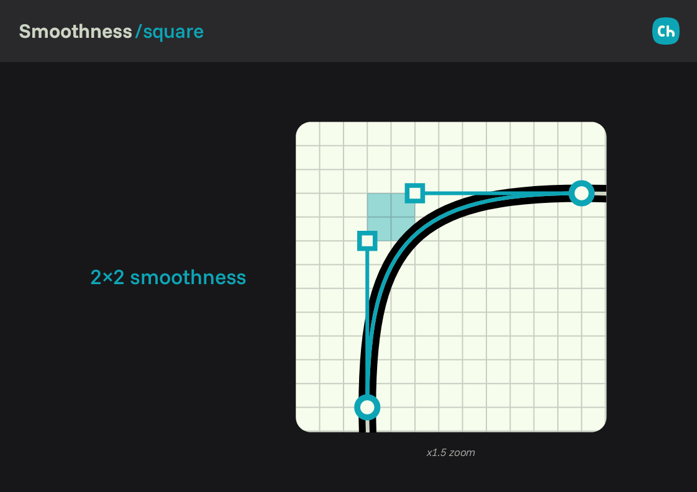
- Rectangular shapes use a tighter handle configuration, resulting in a perceived smoothness of `1×2px / 2×1px`. 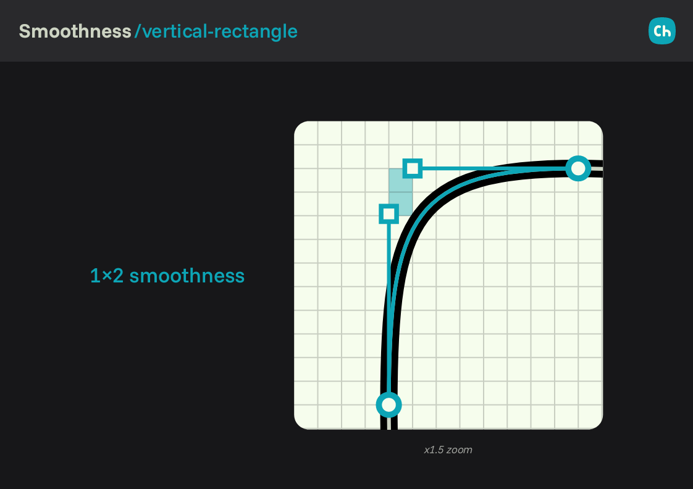 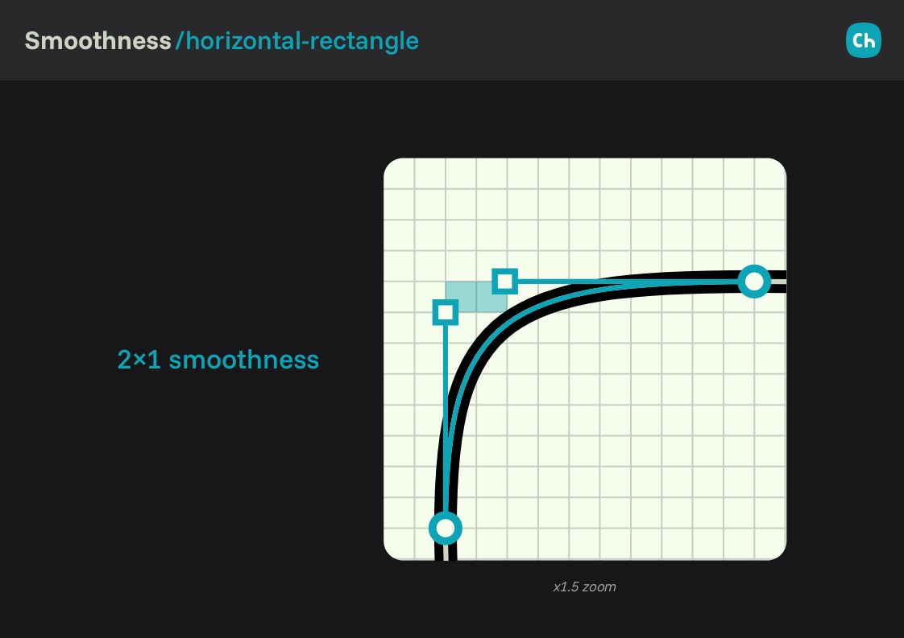
- Circular shapes rely on extended handles to reach a softer curvature, equivalent to `3×3px` smoothness. 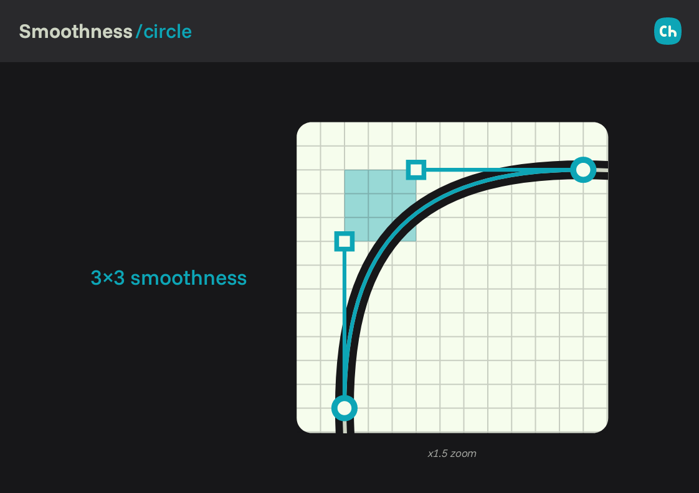

No additional nodes should be introduced to simulate rounded corners. Adding nodes breaks the geometric consistency of the style and produces a flatter, less cohesive result.

#### Scaling

When shapes need to vary in size, they must always be derived from the base shape at its canonical size. Afterward, apply a stroke-scale transformation to preserve the original curvature proportions.

Although scaling may alter the absolute position of the handles, this method ensures that the overall smoothness and volumetric character remain consistent across sizes. Manual redrawing or redefining corners at different scales is discouraged, as it leads to inconsistent curvature and visual noise.

> [!NOTE]
> In contrast to styles like **[Flatter](../flatter/README.md)**, where rounded corners are explicitly constructed using additional nodes per corner, Chubby relies on **continuous curvature** driven by handles. This distinction is critical: Chubby prioritizes softness through simplification, not geometric subdivision.

---

## Synthesis

In icon design, synthesis refers to simplifying and abstracting a shape or concept to make it more minimalist and legible.

At Chubby-Style, we apply synthesis to small elements within an icon's composition. When certain details become too small relative to the overall icon, we simplify them to maintain visual clarity.

Base geometric shapes are altered to add volume. However, if an element becomes too small (due to size or scale), it's abstracted and adjusted to follow standard geometry, preventing loss of definition.

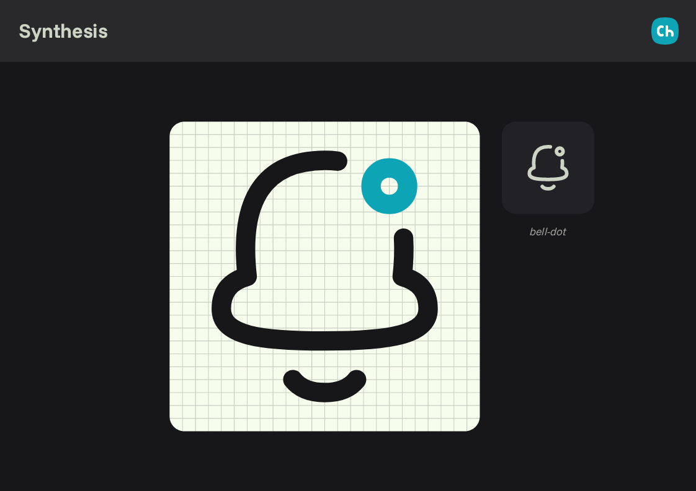

---

## Variants

Learn about the design features for the available variants.

- [chubby/line](./variants/line.md)

**Similar Chubby-Style icons**:

- [flatter (fl)](../flatter/README.md)

---

## Contributing

- [Contribute to Chubby Icons](CONTRIBUTING.md)
