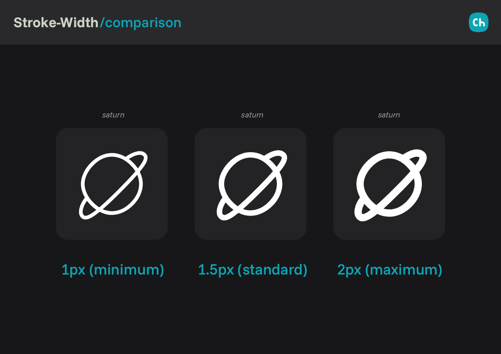
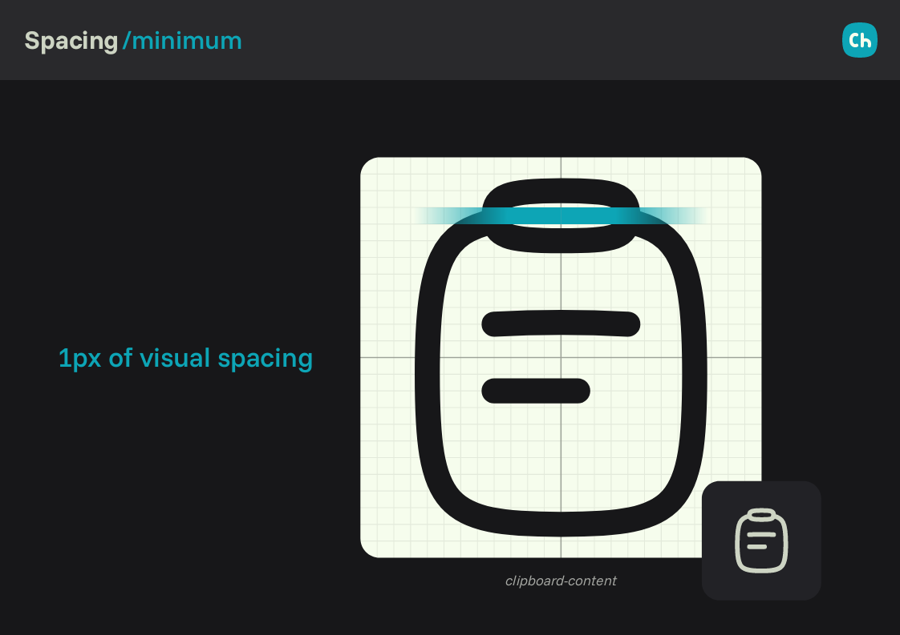
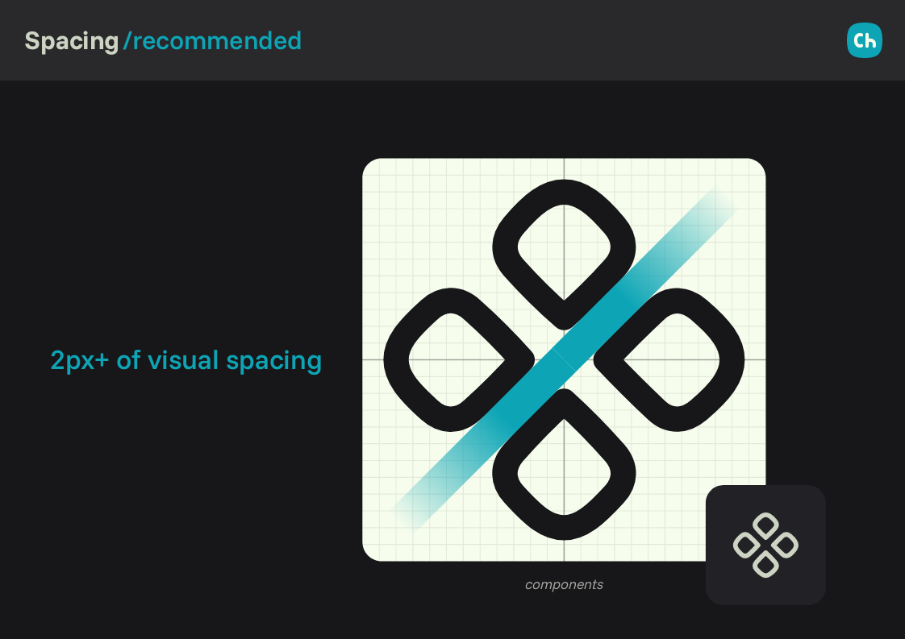
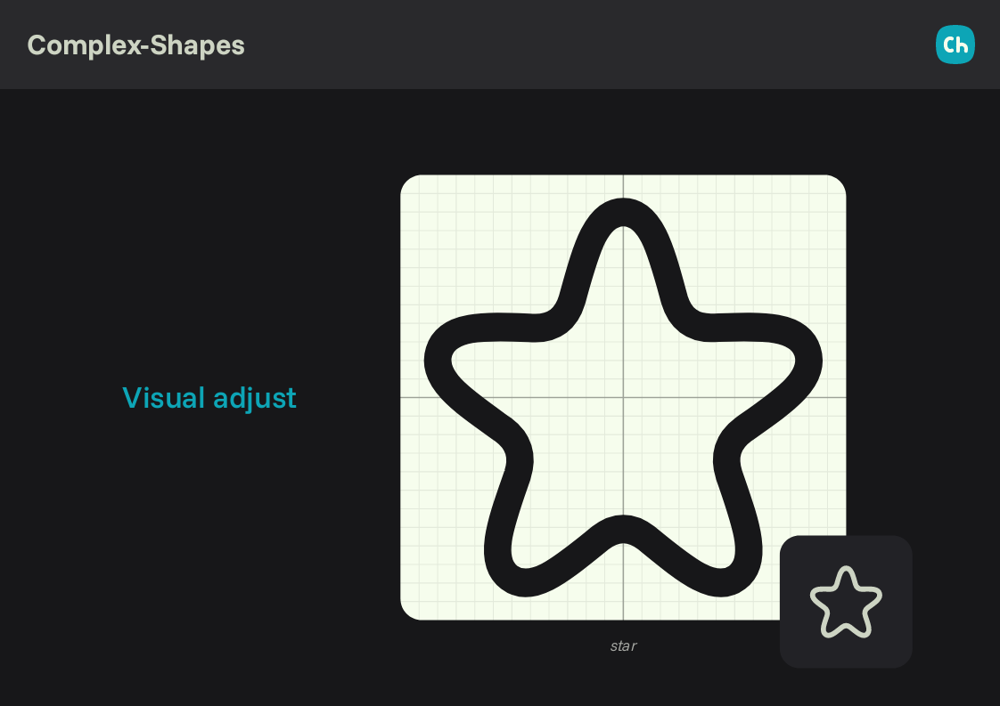

# Chubby / Line
3 min read

### In this file

- [Stroke](#stroke)
- [Color](#color)
- [Spacing](#spacing)
- [Complex Shapes](#complex-shapes)

---

## Stroke

The **Line** variant of the Chubby style is defined by a base stroke width of **`1.5px`**, which is the recommended default value for this style.

Stroke thickness can be adjusted directly using the `stroke-width` property in the SVG source. However, to preserve visual balance and legibility across sizes, acceptable values should remain within the **`1px` to `2px`** range.

Values outside this range may compromise consistency with the rest of the icon set.

---

## Color

In the Line variant, icon color is controlled through the SVG `stroke` property.

By default, icons use **`currentColor`**, allowing their color to automatically inherit the color of the parent element in web and UI contexts. This makes the icons flexible and easy to integrate into different themes without modifying the source file.

For more details about how `currentColor` works, see the official reference:
- <a href="https://developer.mozilla.org/en-US/docs/Web/CSS/color_value#currentcolor_keyword" target="_blank">https://developer.mozilla.org/...</a>

---

## Spacing

A minimum spacing of **`1px`** between shapes is required, while **`2px`** is considered the standard spacing value for the Chubby/Line variant.

Spacing should be adjusted optically based on the relationship between positive and negative shapes, following these guidelines:

### When to Use 1px Spacing

**Meaning Preservation**
- The shape represents a closed or self-contained element
- Internal spacing does not affect symbol recognition
- Suitable for compact interior details

Example: the clipboard icon maintains clarity even with tighter internal spacing.

---

### When to Use 2px or More

**Critical Legibility Cases**
- The icon’s meaning becomes ambiguous at small sizes
- Visual noise appears due to dense shapes
- Stroke widths approach or exceed `2px`

**Optical Corrections**
- Intersecting or overlapping shapes (e.g. `user-plus`)
- Angular intersections that visually reduce negative space
- Curved elements that compress spacing perceptually

Example: the components icon requires increased spacing to maintain clear separation.

---

## Complex Shapes

Some icons in the Line variant involve complex silhouettes that cannot be aligned perfectly to the grid while remaining visually accurate.

In these cases, **legibility takes priority over pixel-perfect alignment**, provided that:
- The icon respects the appropriate key shape
- The overall aspect ratio remains consistent with the style
- Visual balance is preserved at small sizes

This approach allows expressive or irregular forms to remain readable without forcing them into unnatural geometry.

