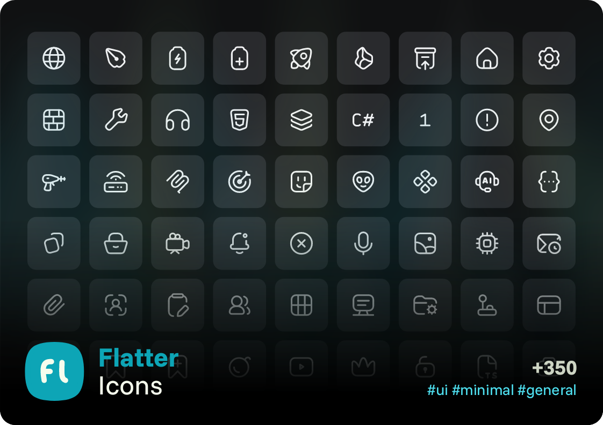
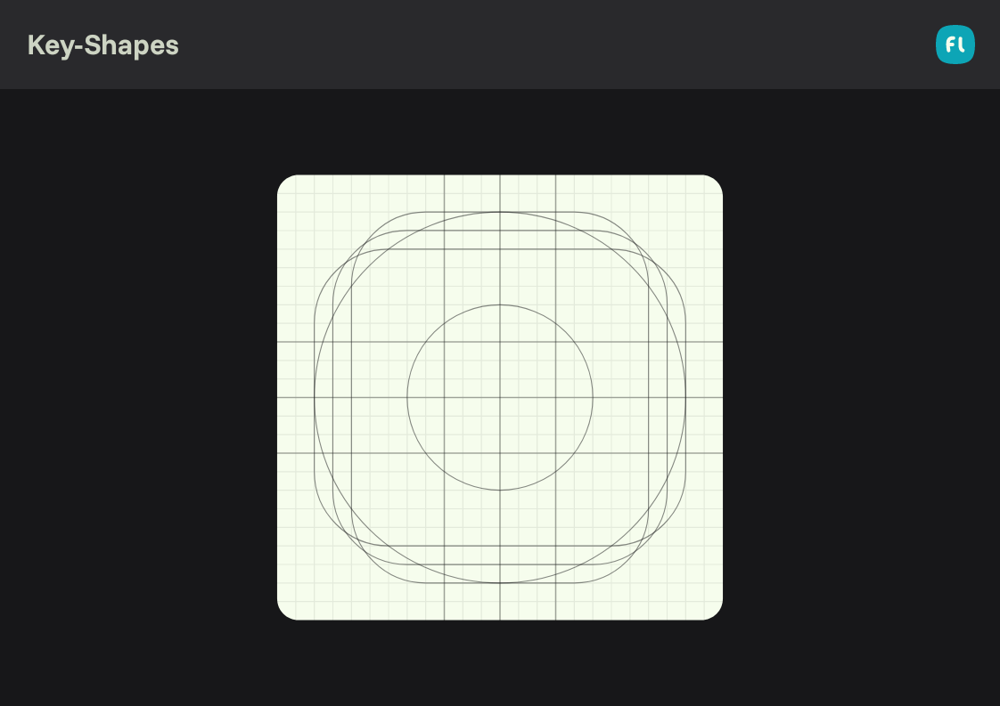
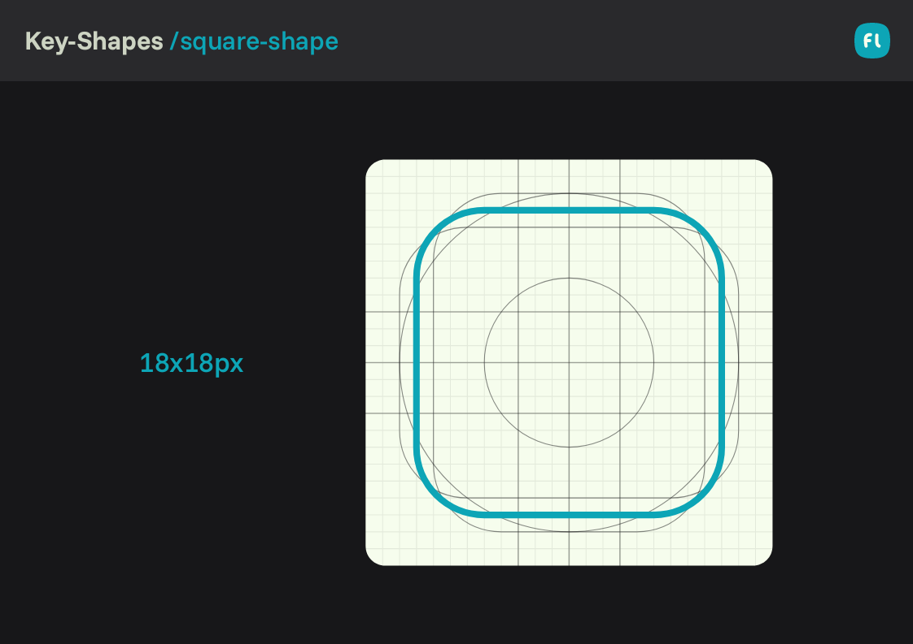
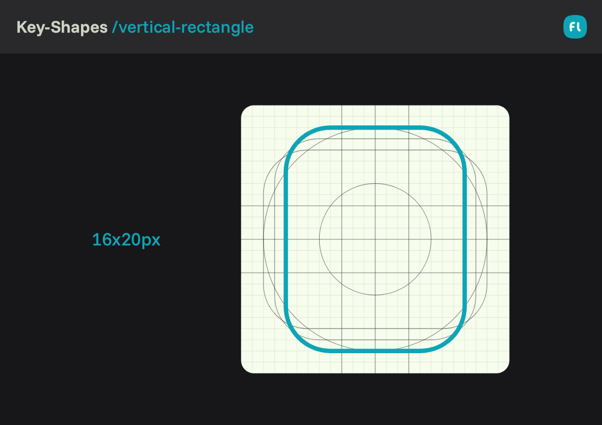
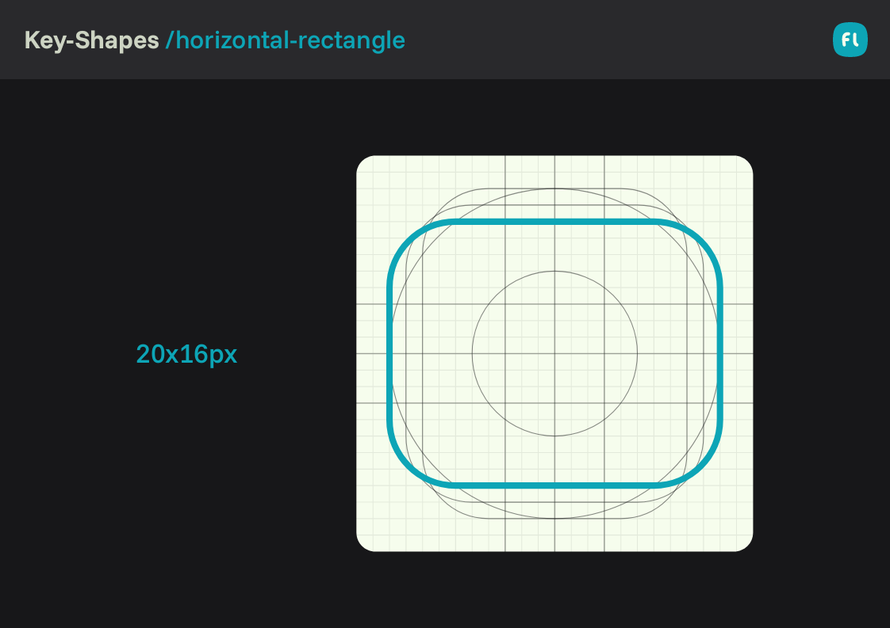
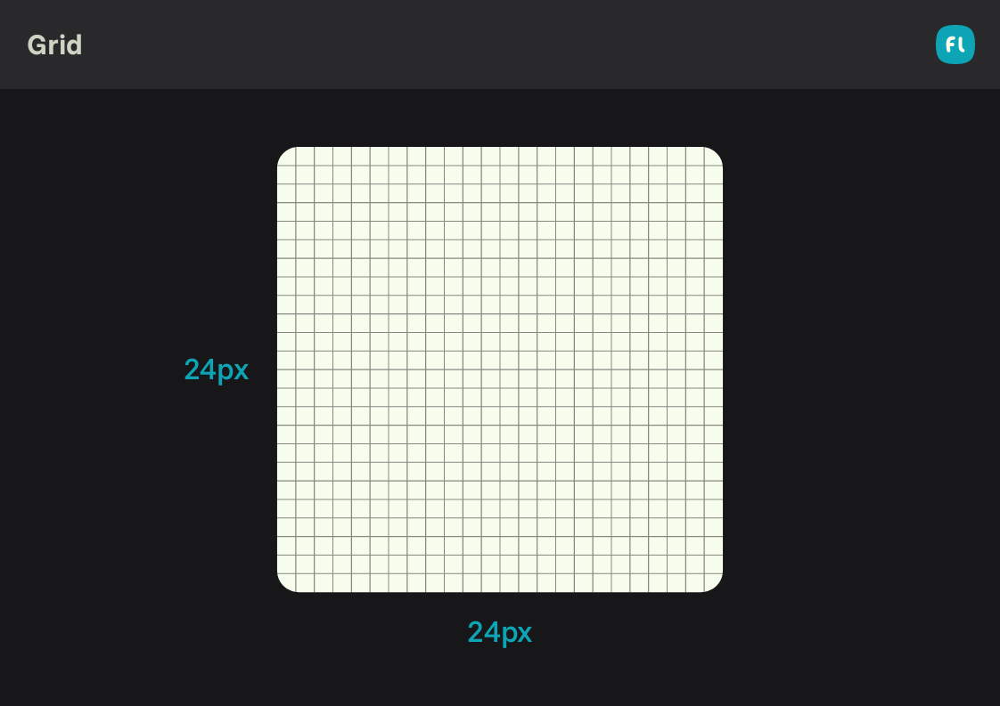
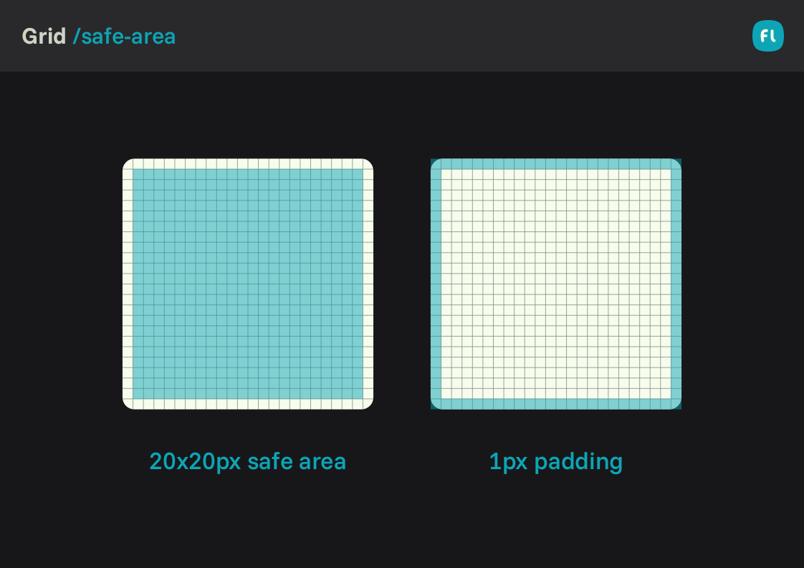
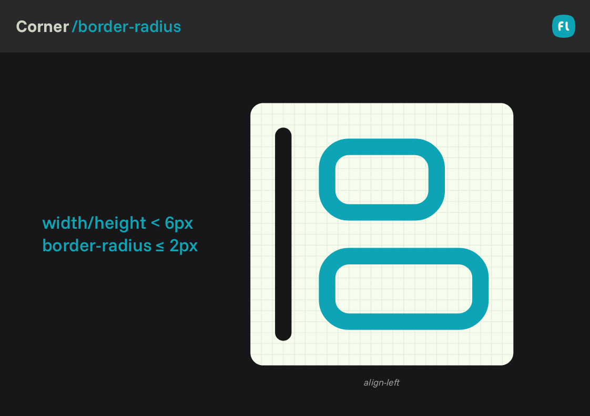
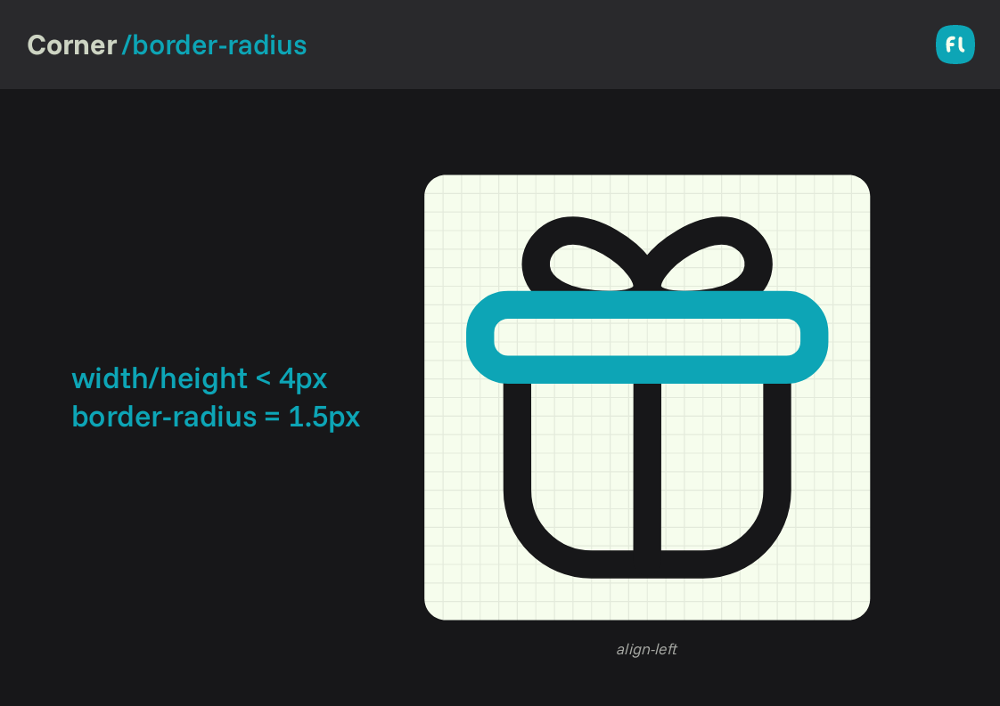

# Flatter Icons: Minimalist flat icons for versatile interfaces

3 min read

<table>
	<thead>
		<th>Variants</th>
		<th>Categories</th>
		<th>Formats</th>
		<th>Use case</th>
	</thead>
	<tbody>
		<tr>
			<td><code>line</code></td>
			<td rowspan="999">UI</td>
			<td><code>svg</code></td>
			<td rowspan="999">Websites, applications, logos, motion graphics</td>
		</tr>
	</tbody>
</table>

Flatter Icons are a simplified and more neutral evolution of the **[Chubby style →](../chubby/README.md)**.

This style reduces visual character and volumetric emphasis to better adapt to interfaces and contexts where a highly expressive style may be excessive or distracting.

Before working with Flatter icons, it is strongly recommended to understand the core principles of the Chubby style, as Flatter inherits and refines many of its foundational rules.

---

### In this file

+ [Key Shapes](#key-shapes)
	+ [Circular Shape](#circular-shape)
	+ [Square Shape](#square-shape)
	+ [Vertical Rectangle](#vertical-rectangle)
	+ [Horizontal Rectangle](#horizontal-rectangle)
+ [Grid](#grid)
+ [Geometry](#geometry)
	+ [Corners](#corners)
+ [Variants](#variants)

---

## Key Shapes

Flatter Icons are built upon four foundational key shapes that define the spatial logic, proportions, and overall balance of the style.

Each key shape corresponds to a specific aspect ratio and use case, ensuring visual consistency while allowing icons to adapt naturally to different compositions and contexts.

### Circular Shape

Used for icons whose visual language is inherently radial or circular.

- Ideal for `circle-*` icons, loaders, and globe-based symbols.  
- Example: [`globe.svg`](../../../icons/flatter/line/globe.svg)  
- Occupies a `20×20` area within the `24×24` grid.

### Square Shape

The default and most versatile base shape.

- Used for icons with symmetric or neutral silhouettes.  
- Fits within an `18×18` safe area to preserve visual breathing room.  
- Well suited for *UI primitives, controls, and common objects*.

### Vertical Rectangle

Designed for icons with a dominant vertical proportion.

- Suitable for objects where height defines the form (e.g. *clipboard, bookmark, door*).  
- Uses a `20×16` container to maintain proportion without visual distortion.

### Horizontal Rectangle

Optimized for icons with wider horizontal compositions.

- Commonly used for *cards, screens, folders, tabs, and mail icons*.  
- Fits within a `16×20` area, providing horizontal presence while maintaining stroke balance.

---

## Grid

The Flatter grid is based on a `24×24px` container with an internal `1px` padding on all sides.  
This padding defines the visual boundaries and prevents overflow.

As a result, the effective safe area is `22×22px`, within which all key shapes must be positioned.

---

## Geometry

Flatter Icons rely on simple geometric constructions with reduced visual complexity.

While the number of nodes may vary depending on the icon’s natural form, the following principles must always be respected to maintain consistency and clarity.

### Corners

Corner rounding is applied selectively based on the visual role of the shape:

- **Basic shapes (square, vertical/horizontal rectangle):** `4px border-radius`
- **More expressive or specific shapes:** 
	- `≥ 1.5px (minimum)`
	- `≤ 6px (maximum)`
- Use **ellipse** for circular shapes

---

## Variants

- [flatter/line](./variants/line.md)

**Related styles**

- [Chubby](../chubby/README.md)

---

## Contributing

- [Contribute to Flatter icons](CONTRIBUTING.md)
