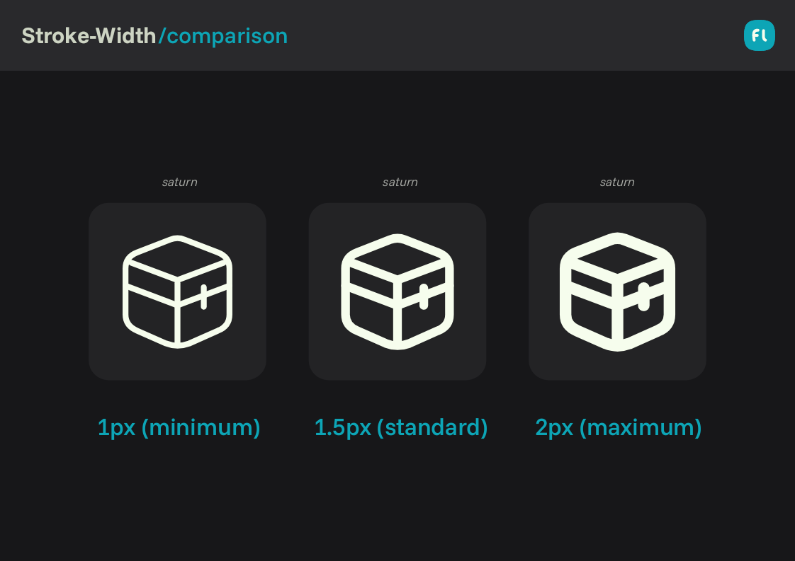
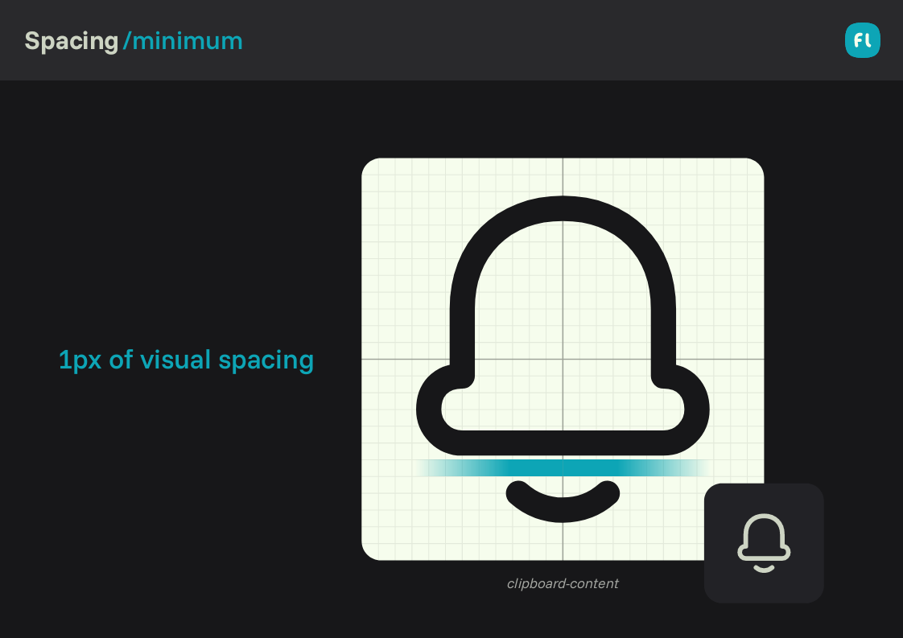
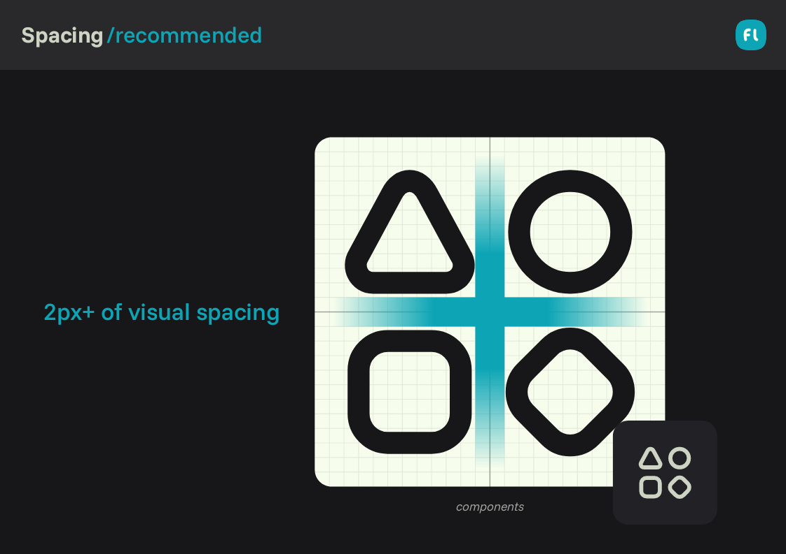
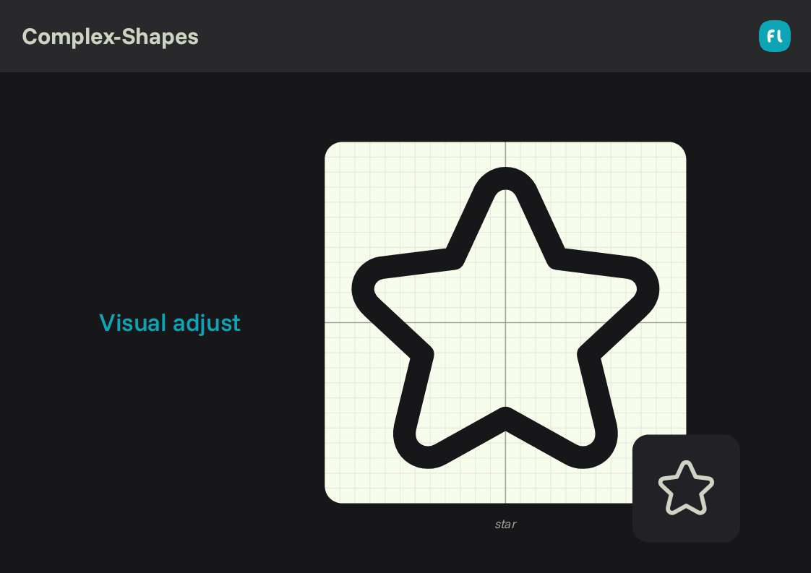

# Flatter/Line
3 min read

### In this file

+ [Stroke](#stroke)
+ [Color](#color)
+ [Spacing](#spacing)
+ [Complex Shapes](#complex-shapes)

---

## Stroke

The line variant of the Flatter style is defined by a **lighter and more restrained stroke**, designed to prioritize clarity and neutrality across diverse interfaces.

The recommended global stroke thickness is `1.25px`.

This slightly thinner stroke differentiates Flatter from Chubby, reducing visual weight while preserving consistency across icon sets.

The stroke thickness can be adjusted via the `stroke-width` property in the SVG source.  
However, for optimal legibility and balance, the recommended range is between:

- **Minimum:** `1px`  
- **Maximum:** `2px`

Values outside this range may compromise visual consistency or introduce unwanted noise at small sizes.

---

## Color

Flatter line icons use the `stroke` property to define color.  
By default, icons rely on the `currentColor` value.

This ensures seamless integration with text and UI components, automatically inheriting color from the parent container in HTML, CSS, and design systems.

For additional context on this behavior, refer to the official documentation:  
→ <a href="https://developer.mozilla.org/en-US/docs/Web/CSS/color_value#currentcolor_keyword" target="_blank">https://developer.mozilla.org/...</a>

---

## Spacing

Spacing in the Flatter style is intentionally more conservative than in Chubby, reflecting its flatter and more restrained visual language.

- **Minimum spacing:** `1px`  
- **Standard spacing:** `2px`

Spacing adapts dynamically based on shape interaction and icon complexity, following these rules:

### When to Use 1px Spacing

**Compact or Self-Contained Elements**
- Shapes are visually independent  
- Tight spacing does not reduce clarity  
- The icon remains legible at small sizes  

### When to Use 2px+ Spacing

**Legibility-Critical Scenarios**
- Overlapping or intersecting shapes  
- Icons with multiple internal elements  
- Situations where small gaps visually collapse at reduced sizes  

**Optical Adjustments**
- Angular intersections  
- Parallel strokes that visually compress space  
- Curved forms that appear closer than measured  

---

## Complex Shapes

When working with complex or irregular symbols in the Flatter line variant, strict grid alignment may not always produce the most readable result.

In such cases:

- **Legibility takes priority over pixel-perfect alignment**
- Shapes may slightly deviate from the grid
- The icon must still respect the intended key-shape proportions

This flexibility allows Flatter icons to remain clear and functional without introducing unnecessary visual tension.

