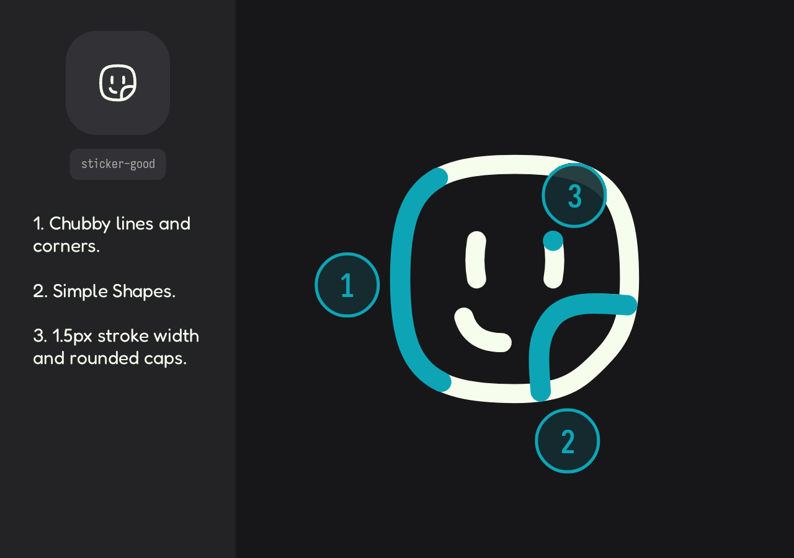

# Principles

2-minute read

This document defines the conceptual and design principles that shape the identity of Altered Icons. It's a guide to understanding the style, structure, and logic behind this icon collection.

**In this file**
+ [Icon Styles ↴](#-icon-styles)
	+ [Chubby](#chubby)
	+ [Flatter](#flatter)
+ [Variants ↴](#-variants)
+ [Categories ↴](#-categories)
+ [Optimization ↴](#-optimization)

---

## 🎭 Icon Styles

AI offers two style or types of icons (**Chubby** and **Flatter**), but both belong to the same **outline** variant.

The differences in stroke shape and geometry are what make up these styles. We'll refer to this as 'Genetically Altered Icons'.

| Type      | Variant | Stroke Width | Geometry                                                       |
| --------- | ------- | ------------ | -------------------------------------------------------------- |
| `Chubby`  | Outline | 1.5px        | The geometry has slightly curved lines and a chubby appearance |
| `Flatter` | Outline | 1.5px        | Geometry-based straight lines                                  |

### Chubby
Designed to offer a more creative and artistic alternative. 

The natural volume of the style is compensated for by using a stroke width of `1.5` pixels. The stroke's *streamlined* and *semi-thin* look makes it a perfect option for modern, minimal interfaces or desktop applications.

**[Icons preview →](../../catalog/chubby-line)**

### Flatter
There are cases where it might be better to choose something more neutral. This is why the main style's personalities are utilized y flatter style, but with a more general tone.

Flatter style icons lack volume in their lines, making them more geometric. We maintain the 1.5 stroke for better consistency.

**[Icons Preview →](../../catalog/flatter-line)**

---

## 🔣 Variants
Three main reasons make the outline variant the primary support and one that will be retained for both icon styles.

1. **Maintenance**: We want to ensure that the maintenance of the main styles is consistent, avoiding slowing down the growth of the project with other variants for the same style.
2. **Utility**: In most cases and projects, the outline variant works well.
3. We want to complete the majority of objectives planned for the future before focusing on new applications.

Other variants, such as fill or duet-tone, are NOT currently supported by Altered Icons. In the near future, this could change based on the opinion of those who consume the material.

---

## 🎰 Categories
There are plans to cover a significant number of categories and subcategories, including topics such as:

- UI
- Actions
- Activities
- Gaming
- Culture
- And all other categories that can benefit from adopting the chubby style.

If you feel a specific area or category needs to be covered, please feel free to open a [new issue (create +)](https://github.com/dot-alter/Altered-Icons/issues).

---

## ⚡ Optimization
Due to our goal of over a thousand icons, we are committed to keeping the source files optimized.

For this, we use tools such as [SVGO (visit)](https://github.com/svg/svgo) or [SVGOMG (visit)](https://jakearchibald.github.io/svgomg/). In addition, keeping a particular format for the SVG code.

---

## See Also

+ [**Icon Design →**](./02_design.md): Discover how chubby and flatter icons are built.
+ [**Metrics →**](./03_metrics.md): If you're considering building this icons, these metrics are important to monitor.