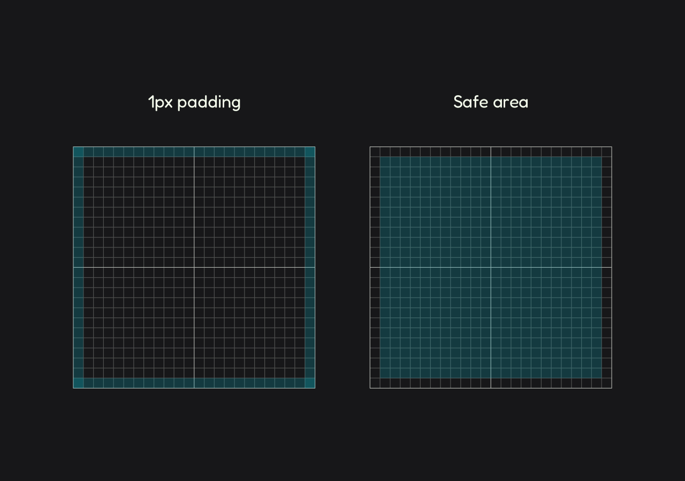
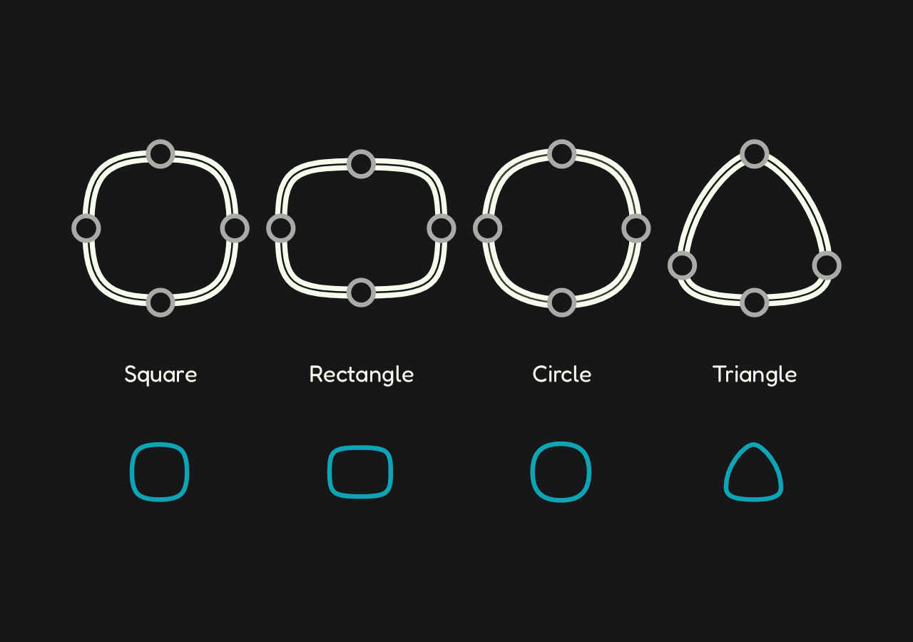
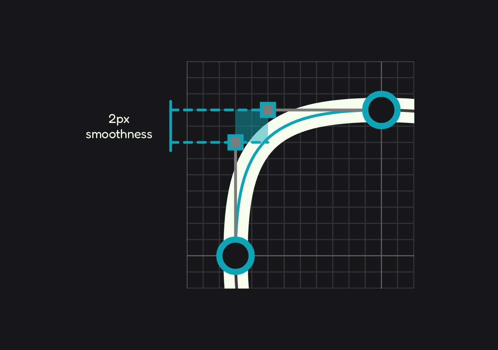
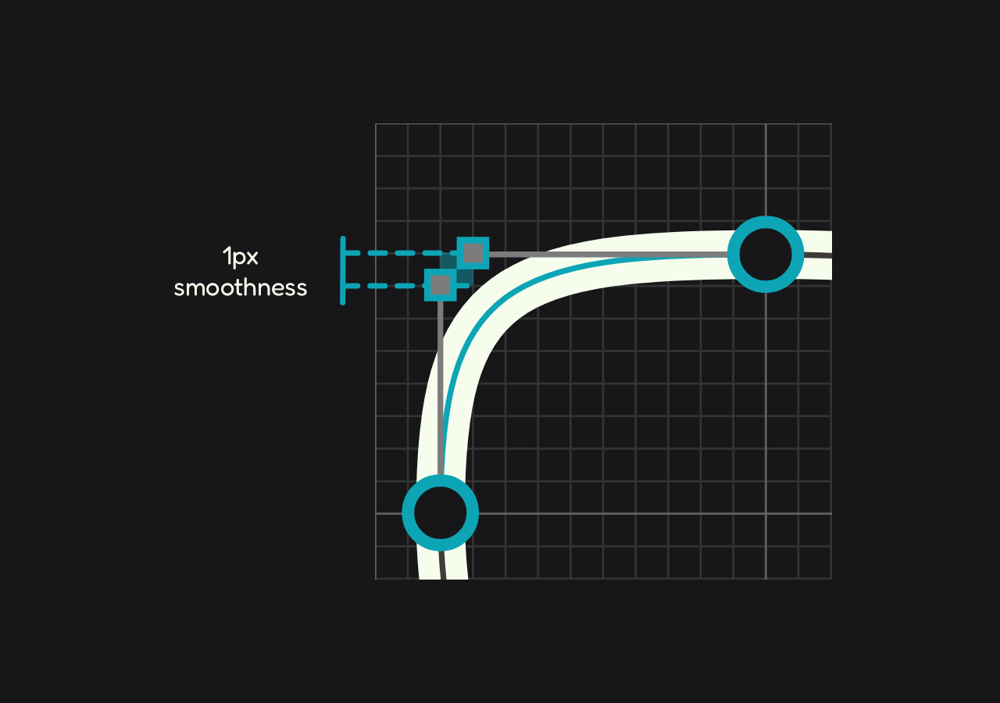
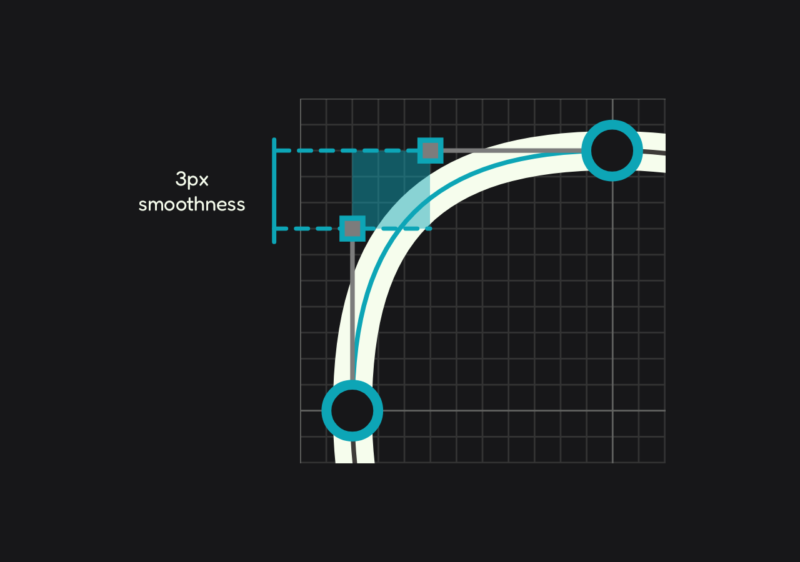

# Icon Design  
3-minute read

Learn how the icons in Altered Icons are structured—from the base layout to proportions, grid systems, and visual morphology.

**In this section**  
+ [Grid ↴](#-grid)  
+ [Geometry ↴](#-geometry)
+ [Stroke ↴](#-stroke)

---

## 📊 Grid

The grid is based on a `24×24px` container, including an internal `1px` padding that defines the boundaries and prevents visual overflow. This results in a **safe area** of `22px` where key shapes are placed.

> `24×24px` is the standard icon size across many design environments.

This padding ensures that icons don't visually collide when placed near other UI elements. It helps maintain consistent alignment, spacing, and system-wide visual harmony.

> [!NOTE] 
> This grid and padding apply to both chubby and flatter styles.

---

## ♦️ Geometry
The morphology of the iconographic family is built from four basic shapes: circle, square, rectangle and triangle. However, the way these forms are constructed is different for both styles. 

### Chubby

+ Basic shapes are built from four nodes. No more, no less.
	

+ All shapes includes corner smoothing. 

The shapes' smoothness and volume are determined by the icon's nature, but there are patterns that repeat for the same shapes.

+ Square shapes have `2px` smoothness at the corners.
	

+ Rectangular shapes have `1px` smoothness at the corners.
	

+ Circular shapes have `3px` smoothing at the corners.
	

### Flatter

+ Nodes are based on the number of corners in a shape.

+ The icons are faithful to the basic geometric shapes (circle, square, rectangle and triangle)

---

## 〰️ Stroke

The entire Altered Icons set supports adjustable stroke widths, with a minimum recommended range of `1.5px` to `2px` (standard), or the weight you need.

> All icons are designed on a 24×24px grid, ensuring consistent scaling when adjusting stroke weights.

---

## 📍 Related links

**Previous**  
+ [Material Principles →](01_basics.md)

**Next**  
+ [Metrics →](03_metrics.md)