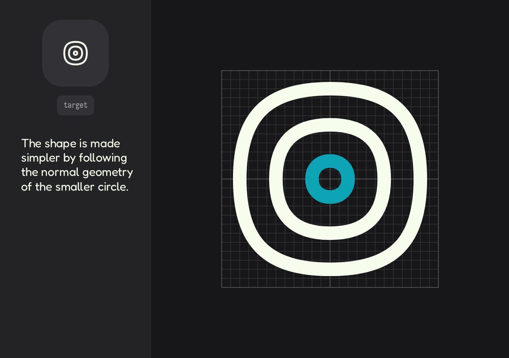
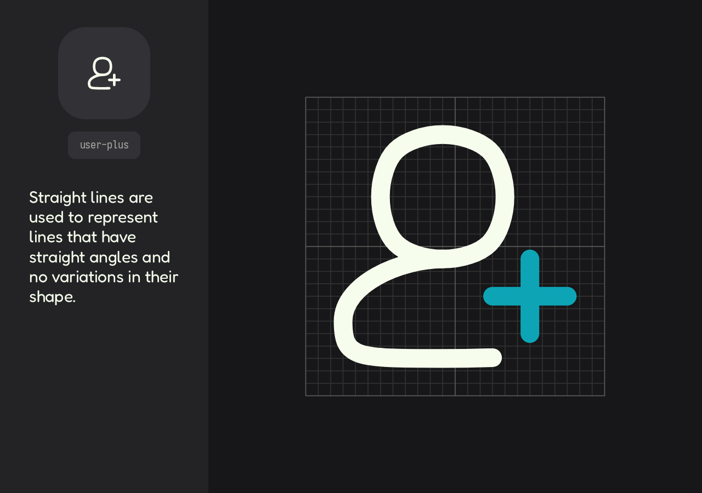
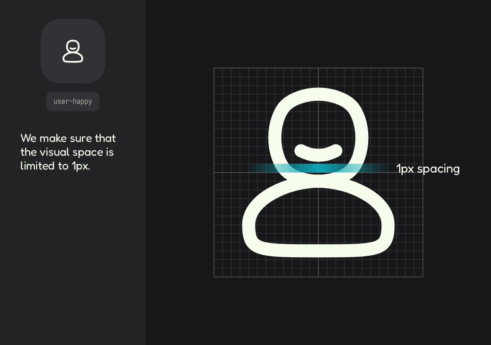
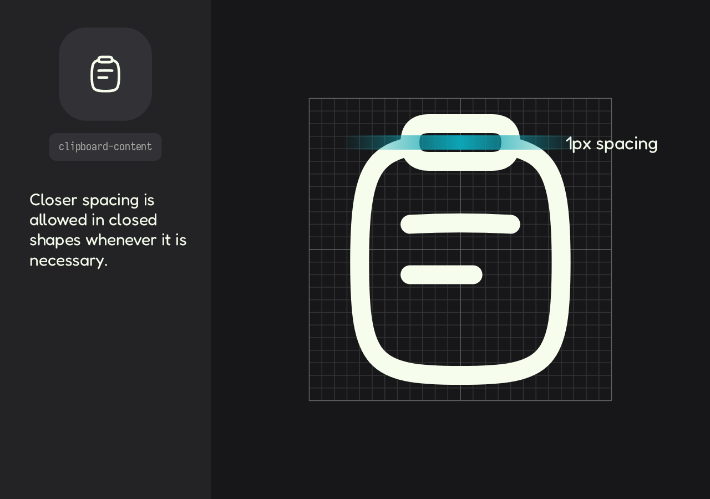
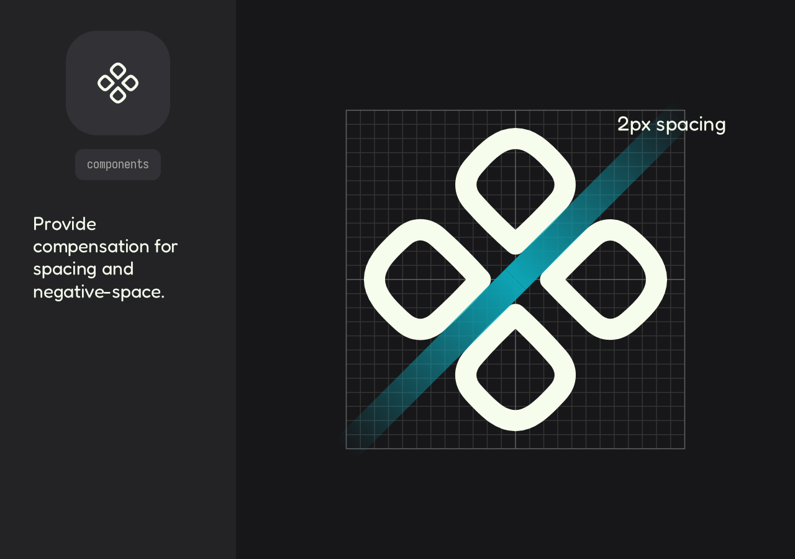

# Construction Metrics  
5-minute read

**In this section**
+ [Synthesis ↴](#-synthesis)
+ [Complex Shapes ↴](#-complex-shapes)
+ [Spacing ↴](#-spacing)

---

## ♻️ Synthesis

In icon design, **synthesis** refers to simplifying and abstracting a shape or concept to make it more minimalist and legible.  

At **Altered-Icons**, we apply synthesis to small elements within an icon's composition. When certain details become too small relative to the overall icon, we simplify them to maintain visual clarity.  

> [!NOTE]  
> This approach is particularly relevant for the *chubby* style.

According to [AI principles](./01_basics.md) for cubby style, base geometric shapes are altered to add volume. However, if an element becomes **too small** (due to size or scale), it's abstracted and adjusted to follow standard geometry, preventing loss of definition.

By default, strokes or lines at **`45°`** and **`90°`** angles are rendered as straight lines without volume treatment in most cases.  

---

## 🏵️ Complex Shapes

Adapting both chubby and flatter styles to complex shapes may require additional layout adjustments.

### Chubby Style

While the chubby style doesn't strictly adhere to pixel-perfect standards (due to its volumetric nature), we implement these fallbacks:

+ When shapes don't align perfectly, we use **half-pixel positioning** as needed
+ Priority is given to visual balance over strict pixel alignment
+ Maintains characteristic curved lines and volumetric effects

### Flatter Style

The flatter style is a simplified version of chubby, maintaining the same core design language but:

+ Removes all volumetric treatments and curved line effects
+ Follows **pixel-perfect** alignment standards as needed
+ Uses simplified geometry while preserving the essential shape language

> [!IMPORTANT] 
> **Design Relationship**  
> Both styles share the same foundational design system - flatter is essentially chubby "**deconstructed**" to its most minimal form, not its opposite.

---

## ↔️ Spacing

We maintain a minimum of `1px` separation between shapes, with `2px` as the standard spacing. These measurements adapt dynamically based on the icon's positive and negative shapes, following these key rules:

### When to Use 1px Spacing

1. **Universal Compatibility**  
	The `1px` separation works across all stroke widths. When using our reference `2px` stroke width: 
	
	- If the resulting negative space appears smaller than `0.5px` visually, expand to `2px` spacing  
	- e.g: User Happy icon 

2. **Meaning Preservation**  
	- The shape represents a closed element  
	- Internal spacing doesn't affect recognition  
	- Example: Clipboard icon: maintains clarity even with tight interior spacing 

### When to Use 2px+ Spacing

1. **Critical Legibility Cases**  
	Upgrade to `2px` spacing when:  
	- The icon's meaning becomes ambiguous
	- Visual noise occurs at smaller sizes  

2. **Optical Corrections**  
	- Intersecting shapes (e.g., "+" over a square)  
	- Angular illusions that make gaps appear smaller  
	- Curved elements that visually compress space  
	- e.g: Components icon 

> "Good spacing is invisible - when done right, you feel the balance before you see the pixels."

> **Visual balance**: Sometimes break rules when the eye demands it. 

---

## See Also

**Previous**
+ [Icon design →](02_design.md)
+ [Collection principles →](01_basics.md)

**Others**
+ [How to contribute →](../../../CONTRIBUTING.md)